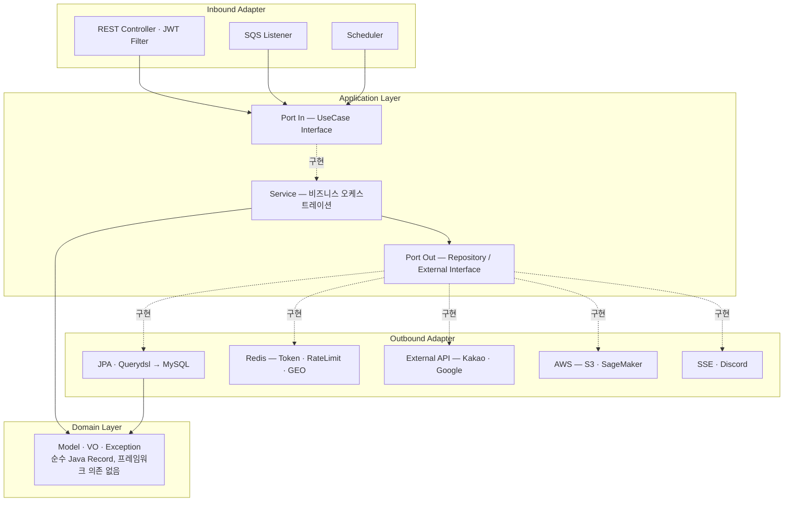
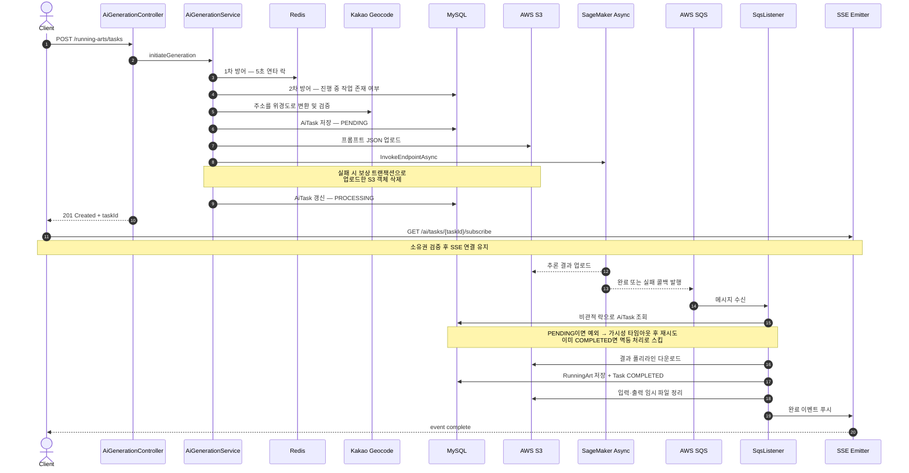

# Aetheria — Server BE

> **GPS 러닝 궤적을 하나의 그림으로 만드는 AI 러닝 아트 코스 생성 서비스의 백엔드 서버**


**담당 범위 — 백엔드 서버 전 영역 단독 설계·구현.** 도메인 모델링, 헥사고날 아키텍처 설계, OAuth2/JWT 인증 인프라, AI 비동기 파이프라인, AWS 연동(S3·SageMaker·SQS), 장애 대응 설계, 테스트 코드까지 전부 직접 작성했습니다.

---

## 목차

- [서비스 소개](#서비스-소개)
- [기술 스택](#기술-스택)
- [아키텍처](#아키텍처)
- [기술적 의사결정 및 트러블슈팅](#기술적-의사결정-및-트러블슈팅)
- [API 명세](#api-명세)
- [프로젝트 구조](#프로젝트-구조)
- [실행 방법](#실행-방법)
- [테스트](#테스트)

---

## 서비스 소개

사용자가 **출발 지점(주소)**, **그리고 싶은 모양**, **본인의 러닝 숙련도**를 입력하면, AI가 실제로 달릴 수 있는 러닝 코스를 그 모양대로 설계해 돌려줍니다.

서버는 요청을 받는 즉시 `taskId`를 반환하고 실제 추론은 백그라운드에서 진행됩니다. AI 추론이 완료되면 SageMaker가 S3에 결과를 올리고 SQS로 콜백을 보내며, 서버는 이를 소비해 폴리라인을 GPX 코스로 변환·저장한 뒤 **SSE로 클라이언트에 실시간 완료 알림**을 푸시합니다. 완성된 코스는 Redis GEO 인덱스에 등록되어 다른 사용자의 "내 주변 러닝 아트 찾기" 검색 대상이 됩니다.

즉 이 서버의 본질은 **"수 분 단위로 걸리고, 중간에 언제든 실패할 수 있으며, 실패하면 비용이 청구되는 외부 작업"을 안전하게 오케스트레이션하는 것**입니다. 아래 트러블슈팅 섹션은 대부분 이 지점에 대한 기록입니다.

---

## 기술 스택

| 분류 | 사용 기술 |
| --- | --- |
| **Language / Runtime** | Java 17 |
| **Framework** | Spring Boot 3.5.8, Spring MVC, **Spring WebFlux (Reactor)** |
| **Persistence** | Spring Data JPA, Hibernate, **Querydsl 5.0.0 (Jakarta)**, MySQL 8, **Flyway** (스키마 마이그레이션) |
| **Cache / In-Memory** | Redis (Lettuce), **Lua Script**, Redis GEO, Redis Pub/Sub, Caffeine |
| **Auth / Security** | Spring Security, OAuth2 Client (Kakao·Google), **JWT (jjwt 0.11.5)**, AES-GCM 필드 암호화 |
| **Resilience** | **Resilience4j 2.2.0** (Circuit Breaker), Spring AOP, **ShedLock 5.13.0** (Redis Provider) |
| **Cloud** | AWS SDK v2 (BOM 2.24.0) — **S3**, **SageMaker Async Inference**, **SQS** (Spring Cloud AWS 3.1.1) |
| **Realtime** | SSE (`SseEmitter`) + Redis Pub/Sub 기반 다중 인스턴스 브로드캐스트 |
| **Docs / Ops** | SpringDoc OpenAPI 2.8.3 (Swagger UI), Spring Actuator, Discord Webhook 알림 |
| **Test** | JUnit 5, Mockito, AssertJ, Reactor Test, Spring Security Test, **OkHttp MockWebServer** |

---

## 아키텍처

### 헥사고날 아키텍처 (Ports & Adapters)

도메인이 프레임워크·인프라에 의존하지 않도록 계층을 분리했습니다. `domain` 패키지는 **Spring·JPA 애노테이션이 단 하나도 없는 순수 Java Record**로만 구성되어 있으며, 모든 도메인 모델이 불변(Immutable)입니다.



> 의존 방향은 항상 **바깥 → 안쪽**입니다. 어댑터를 교체해도 `application`·`domain`은 수정되지 않습니다.

### AI 생성 파이프라인 시퀀스

가장 복잡한 흐름입니다. **요청 처리**와 **결과 수신**이 완전히 분리된 비동기 구조이며, 각 단계마다 실패 시나리오가 정의되어 있습니다.



> **10분이 지나도 콜백이 오지 않는 좀비 태스크**는 5분 주기 스케줄러가 회수해 `FAILED` 처리하고 클라이언트에 실패 알림을 보냅니다. (`TaskTimeoutScheduler`)

---

## 기술적 의사결정 및 트러블슈팅

### 1. WebFlux 이벤트 루프 블로킹 — 전 구간 스레드 격리

**문제** · AI 파이프라인은 외부 API 대기 시간이 길어 WebFlux로 구현했지만, 그 안에서 호출하는 JPA·Redis·AWS SDK v2 동기 클라이언트는 전부 **블로킹 I/O**입니다.

**원인** · Netty 이벤트 루프 스레드는 CPU 코어 수만큼만 존재합니다. 이 스레드가 DB 응답을 기다리며 멈추면 **서버 전체의 모든 요청 처리가 함께 멈춥니다.**

**해결** · 파이프라인 내 모든 블로킹 구간을 `Mono.fromCallable(...).subscribeOn(Schedulers.boundedElastic())`으로 감싸 전용 스레드 풀로 격리했습니다. Rate Limit 검증, PENDING 저장, S3 업로드, SageMaker 호출, 상태 갱신, 에러 기록 — 예외 없이 전부 적용했습니다.

> 근거 · [`AiGenerationService.java`](src/main/java/com/serverbe/application/service/AiGenerationService.java)

---

### 2. S3 고아 파일 — Saga 보상 트랜잭션

**문제** · S3 업로드는 성공했는데 직후 SageMaker 호출이 실패하면, 아무도 참조하지 않는 파일이 S3에 영구히 남습니다.

**원인** · S3와 SageMaker는 서로 다른 외부 시스템이라 **하나의 트랜잭션으로 묶을 수 없습니다.** DB 롤백은 이 파일을 지워주지 않으며, 그대로 두면 스토리지 비용으로 누적됩니다.

**해결** · Saga 패턴의 보상 트랜잭션을 적용했습니다. SageMaker 호출 단계에 `onErrorResume`을 걸어 실패 시 방금 올린 S3 객체를 삭제합니다. 이때 **보상 로직 자체가 실패하더라도 원본 예외를 우선 전파**하도록 설계했습니다 — 삭제 실패로 원인 예외가 가려지면 디버깅이 불가능해지기 때문입니다. 삭제 실패 건은 수동 정리가 가능하도록 별도 `ERROR` 로그로 남기고, 추가 안전망으로 S3 Lifecycle 정책(임시 경로 1일 후 자동 만료)을 애플리케이션 기동 시 등록합니다.

> 근거 · [`AiGenerationService.java`](src/main/java/com/serverbe/application/service/AiGenerationService.java) `compensateS3Upload`, [`S3LifecyclePolicyInitializer.java`](src/main/java/com/serverbe/infrastructure/config/S3LifecyclePolicyInitializer.java) · 커밋 `826fe6a`

---

### 3. SQS 콜백 경합 조건 — 비관적 락과 재시도 유도

**문제** · SageMaker 추론이 매우 빨리 끝나면, **완료 콜백이 서버가 `PROCESSING` 상태를 저장하기도 전에 도착**합니다. 리스너는 아직 `PENDING` 상태인 태스크를 보고 실패 처리해 버립니다. 반대로 SQS의 at-least-once 특성 때문에 동일 메시지가 중복 수신되어 러닝 아트가 두 번 저장되는 문제도 있었습니다.

**원인** · 요청 스레드와 SQS 리스너 스레드가 **동일한 `AiTask` 레코드에 순서 보장 없이 접근**하는 전형적인 경합 조건입니다.

**해결**

- 리스너를 `@Transactional`로 묶고 **비관적 락**으로 태스크를 조회해 동시 접근을 직렬화했습니다.
- 상태가 아직 `PENDING`이면 예외를 던져 **SQS 가시성 타임아웃 후 자연스럽게 재시도**되도록 유도했습니다. 이미 `COMPLETED`면 멱등하게 스킵합니다.
- 최종적으로 처리에 실패한 메시지는 예외를 그대로 전파해 **DLQ로 이동**시켜 유실을 방지했습니다.

> 근거 · [`AiNotificationSqsListener.java`](src/main/java/com/serverbe/infrastructure/config/event/AiNotificationSqsListener.java) · 커밋 `51cf87f`, `cae72bf`

---

### 4. 스케줄러 중복 실행 — ShedLock 분산 락

**문제** · 좀비 태스크 정리 스케줄러가 서버를 2대 이상으로 확장하는 순간 **동시에 실행**되어, 같은 태스크에 대해 실패 알림이 중복 발송되었습니다.

**원인** · `@Scheduled`는 JVM 단위로 동작합니다. 인스턴스가 늘어나면 스케줄러도 그만큼 늘어납니다.

**해결** · Redis Provider 기반 ShedLock을 도입하되, 두 파라미터의 의미를 구분해 설정했습니다.

- `lockAtLeastFor = 4m` — 작업이 1초 만에 끝나 락이 즉시 풀리면, **서버 간 NTP 시계 오차(1~2초)** 로 뒤늦게 트리거된 다른 인스턴스가 중복 실행합니다. 실행 주기(5분)보다 약간 짧게 잡아 이를 차단했습니다.
- `lockAtMostFor = 10m` — 락을 쥔 서버가 OOM 등으로 죽었을 때 **락이 영구히 남는 데드락**을 방지하는 안전장치입니다.

> 근거 · [`TaskTimeoutScheduler.java`](src/main/java/com/serverbe/infrastructure/scheduler/TaskTimeoutScheduler.java) · 커밋 `9423dbb`, `db03584`

---

### 5. Rate Limiting — Lua 원자적 토큰 버킷과 서킷 브레이커 폴백

**문제** · SageMaker 추론은 **호출 1건당 비용이 발생**합니다. 버튼 연타 한 번이 그대로 요금입니다. 반면 Redis 기반 카운터는 `GET → 계산 → SET` 사이에 다른 요청이 끼어들면 한도를 초과 허용하는 Race Condition이 있습니다.

**해결**

- **원자성** — 토큰 버킷의 조회·리필 계산·갱신을 **단일 Lua 스크립트**로 작성해 Redis 상에서 원자적으로 실행되도록 했습니다. 버스트를 허용하는 `capacity`와 평균 처리율을 결정하는 `refillRate`를 분리해, 잠시 쉬었다 보내는 정상 사용자를 막지 않으면서 지속적인 남용은 차단합니다.
- **다층 방어** — 비용이 발생하는 지점 **이전**에 차단하도록 배치했습니다. 1차는 Redis 5초 연타 방지, 2차는 DB의 "1인 1작업" 규칙 검증. 지오코딩 API 호출조차 이 검증을 통과해야 도달합니다.
- **선언적 적용** — `@RateLimit(target = IP, capacity = 10, refillRate = 5)` 형태의 반복 가능(`@Repeatable`) 애노테이션과 AOP로, 엔드포인트마다 IP·USER 정책을 동시에 걸 수 있게 했습니다.
- **Redis 장애 대응** — Rate Limiter가 죽었다고 서비스 전체가 멈춰선 안 됩니다. Resilience4j 서킷 브레이커로 감싸고, 폴백에서는 **Caffeine 로컬 캐시로 축소된 방어선**을 유지합니다. 사용자 단위는 로컬 카운팅으로 계속 차단하고, IP 단위는 Fail-Open으로 가용성을 우선합니다.

> 근거 · [`token_bucket.lua`](src/main/resources/scripts/token_bucket.lua), [`RateLimiterService.java`](src/main/java/com/serverbe/application/service/RateLimiterService.java), [`RateLimitAspect.java`](src/main/java/com/serverbe/infrastructure/config/aop/RateLimitAspect.java), [`RateLimitFallbackHandler.java`](src/main/java/com/serverbe/application/service/fallback/RateLimitFallbackHandler.java) · 커밋 `2ad20c4`

---

### 6. Refresh Token Rotation — Lua 원자적 회전과 기기별 세션 관리

**문제** · Refresh Token 재발급은 ① 구 토큰 블랙리스트 등록 ② 신 토큰 저장 ③ 세션 인덱스 갱신 ④ 최대 기기 수 초과분 제거 — **네 개 연산이 전부 성공하거나 전부 실패해야** 합니다. 중간에 끊기면 탈취된 구 토큰이 계속 유효하거나, 정상 사용자가 로그아웃됩니다.

**해결**

- 네 개 연산을 **하나의 Lua 스크립트**로 묶어 원자적으로 실행합니다. 구 토큰의 잔여 TTL(`PTTL`)을 그대로 블랙리스트 TTL로 사용해 불필요한 메모리 점유를 없앴습니다.
- 기기별 세션을 **Redis ZSET**으로 관리해, 최대 동시 로그인 기기 수를 초과하면 가장 오래된 기기부터 자동 만료시킵니다.
- 토큰은 원문이 아닌 **SHA-256 해시**로만 저장하며, 로그아웃·전역 로그아웃도 각각 전용 Lua 스크립트로 처리합니다.

> 근거 · [`rotate_token.lua`](src/main/resources/scripts/rotate_token.lua), [`global_logout.lua`](src/main/resources/scripts/global_logout.lua), [`TokenPersistenceAdapter.java`](src/main/java/com/serverbe/adapter/out/persistence/token/TokenPersistenceAdapter.java) · 커밋 `68428b8`

---

### 그 외 설계 기록

- **트랜잭션 커밋 이후 Redis 반영** — 러닝 아트 삭제 시 DB 삭제와 Redis GEO 삭제를 함께 수행하면, DB가 롤백되어도 Redis 데이터는 이미 사라져 정합성이 깨집니다. `TransactionSynchronization#afterCommit`으로 커밋 성공 이후에만 GEO를 갱신하도록 분리했습니다. ([`RunningArtService.java`](src/main/java/com/serverbe/application/service/RunningArtService.java), 커밋 `14d73c1`)
- **서킷 브레이커 오작동 방지** — 외부 API의 4xx는 *우리 요청이 잘못된 것*이고 5xx는 *상대 서버 장애*입니다. 이를 `ExternalApiClientException` / `ExternalApiException`으로 분리하고 4xx를 `ignoreExceptions`에 등록해, 잘못된 주소 입력이 반복될 때 회로가 열려버리는 문제를 막았습니다. 응답 지연으로 인한 스레드 고갈에 대비해 `slowCallRateThreshold`도 함께 설정했습니다. ([`application.yml`](src/main/resources/application.yml))
- **PII 필드 암호화와 무중단 키 교체** — 이메일 등 민감 정보를 JPA `AttributeConverter`로 **AES-GCM 자동 암복호화**합니다. 암호문에 키 버전을 새겨두고, 구버전 키로 암호화된 데이터를 읽으면 마이그레이션 대상으로 표시해 점진적으로 재암호화합니다. ([`CryptoConverter.java`](src/main/java/com/serverbe/adapter/out/persistence/converter/CryptoConverter.java), [`AesGcmEncryptor.java`](src/main/java/com/serverbe/infrastructure/crypto/AesGcmEncryptor.java))
- **DB 커넥션 풀 보호** — AI 결과 처리는 S3 다운로드·삭제, SSE 발송 등 긴 네트워크 I/O를 포함합니다. 메서드 전체에 `@Transactional`을 걸면 그동안 커넥션을 점유해 풀이 고갈됩니다. `TransactionTemplate`으로 **DB 쓰기 구간만** 원자적으로 감싸고 외부 I/O는 트랜잭션 밖으로 뺐습니다. ([`AiResultRetrievalService.java`](src/main/java/com/serverbe/application/service/AiResultRetrievalService.java))
- **다중 인스턴스 SSE** — SSE 연결은 특정 인스턴스에 고정되지만 완료 이벤트는 다른 인스턴스에서 발생할 수 있습니다. Redis Pub/Sub으로 이벤트를 브로드캐스트해 어느 인스턴스가 받든 올바른 클라이언트에게 전달되도록 했습니다. ([`SseNotificationAdapter.java`](src/main/java/com/serverbe/adapter/out/notification/SseNotificationAdapter.java), [`SseRedisSubscriber.java`](src/main/java/com/serverbe/adapter/out/notification/SseRedisSubscriber.java))
- **스키마 관리를 `ddl-auto`에서 Flyway로 이관** — 동시 요청을 막는 유니크 제약을 추가하면서 `ddl-auto: update`에 맡길 수 없다고 판단했습니다. Hibernate의 `update`는 컬럼 추가는 해주지만 **기존 테이블에 유니크 제약을 붙여준다는 보장이 없고, 새 컬럼에 기존 행을 백필할 수도 없습니다.** 실제로 마이그레이션 대상 DB에는 한 사용자에게 진행 중 작업이 7건 쌓여 있어, 정리 없이는 유니크 인덱스 생성 자체가 실패하는 상태였습니다. `기존 중복 정리 → 컬럼 추가 → 백필 → 제약 생성` 순서를 명시적 SQL로 작성하고 `ddl-auto`는 `validate`로 낮춰, 스키마 변경 권한을 한 곳으로 모았습니다. ([`V2__add_active_task_slot.sql`](src/main/resources/db/migration/V2__add_active_task_slot.sql))
- **표준화된 에러 응답** — 도메인별 `ErrorCode` enum과 `BusinessException` 계층을 정의하고 `@RestControllerAdvice`에서 일괄 변환해, 모든 API가 동일한 응답 포맷을 갖도록 했습니다. ([`BusinessExceptionHandler.java`](src/main/java/com/serverbe/infrastructure/error/BusinessExceptionHandler.java), [`RestApiResponse.java`](src/main/java/com/serverbe/infrastructure/common/response/RestApiResponse.java))

---

## API 명세

전체 명세는 서버 실행 후 **Swagger UI (`/swagger-ui.html`)** 에서 확인할 수 있습니다.

### 인증 · 인가 — `/api/v1/auth`

| Method | Endpoint | 설명 | 인증 |
| --- | --- | --- | :---: |
| `GET` | `/login/{provider}` | 소셜 로그인 리다이렉트 (kakao / google) | — |
| `GET` | `/callback/{provider}` | 소셜 로그인 콜백 — 인가 코드로 토큰 발급 | — |
| `POST` | `/reissue` | 토큰 재발급 (Refresh Token Rotation) | Cookie |
| `POST` | `/logout` | 현재 기기 로그아웃 | 필요 |
| `POST` | `/logout/all` | 전역 로그아웃 — 모든 기기 세션 파기 | 필요 |
| `DELETE` | `/me` | 회원 탈퇴 — 소셜 연결 해제 및 데이터 삭제 | 필요 |

### 사용자 — `/api/v1/users`

| Method | Endpoint | 설명 | 인증 |
| --- | --- | --- | :---: |
| `GET` | `/me` | 내 프로필 조회 | 필요 |
| `PATCH` | `/me` | 내 프로필 수정 | 필요 |

### 러닝 아트 — `/api/v1/running-arts`

| Method | Endpoint | 설명 | 인증 |
| --- | --- | --- | :---: |
| `GET` | `/me` | 내 러닝 아트 목록 조회 (페이징) | 필요 |
| `GET` | `/{runningArtId}` | 러닝 아트 단건 상세 조회 | 필요 |
| `PATCH` | `/{runningArtId}` | 러닝 아트 메타데이터 수정 | 필요 |
| `DELETE` | `/{runningArtId}` | 러닝 아트 삭제 | 필요 |
| `DELETE` | `/me` | 내 모든 러닝 아트 삭제 | 필요 |
| `GET` | `/nearby?lat=&lon=&radius=` | 주변 러닝 아트 반경 검색 (Redis GEO) | 필요 |

### AI 생성 작업 — `/api/v1/running-arts/tasks`

| Method | Endpoint | 설명 | 인증 |
| --- | --- | --- | :---: |
| `POST` | `/` | AI 코스 생성 요청 — 즉시 `taskId` 반환 | 필요 |
| `GET` | `/{taskId}` | 작업 진행 상태 폴링 조회 (소유권 검증 포함) | 필요 |

### 실시간 알림 · 부가 기능

| Method | Endpoint | 설명 | 인증 |
| --- | --- | --- | :---: |
| `GET` | `/api/v1/ai/tasks/{taskId}/subscribe` | AI 작업 상태 SSE 구독 (`text/event-stream`) | 필요 |
| `GET` | `/api/v1/geocode` | 주소를 위경도로 변환 (지오코딩) | 필요 |

---

## 프로젝트 구조

```
src/main/java/com/serverbe
├── adapter                      # 외부 세계와의 접점
│   ├── in/web                   # REST 컨트롤러, JWT 필터, 요청·응답 DTO
│   │   ├── filter               # JwtAuthenticationFilter
│   │   └── support              # @ExtractIp, @ExtractDeviceId 등 ArgumentResolver
│   └── out
│       ├── persistence          # JPA 엔티티 · Querydsl · Redis 어댑터 · 매퍼
│       ├── external             # Kakao / Google OAuth·지오코딩, S3, SageMaker
│       └── notification         # SSE Emitter, Redis Pub/Sub 구독자
│
├── application                  # 유스케이스 계층
│   ├── port/in                  # 인바운드 포트 (UseCase 인터페이스)
│   ├── port/out                 # 아웃바운드 포트 (Repository·External 인터페이스)
│   ├── service                  # 유스케이스 구현 — 비즈니스 오케스트레이션
│   │   ├── fallback             # 서킷 브레이커 폴백 핸들러
│   │   └── helper               # 보조 컴포넌트
│   └── annotation               # @RateLimit
│
├── domain                       # 순수 도메인 — 프레임워크 의존 없음
│   ├── model                    # User, RunningArt, AiTask, Address + VO (전부 Record)
│   ├── exception                # 도메인별 ErrorCode / BusinessException 계층
│   └── util                     # PolylineUtils
│
└── infrastructure               # 기술 관심사
    ├── config                   # Bean 설정, @ConfigurationProperties, SQS 리스너
    ├── security                 # SecurityConfig, JwtTokenProvider, JwtKeyManager
    ├── crypto                   # AES-GCM 암호화, 키 버저닝
    ├── scheduler                # 좀비 태스크 정리 스케줄러
    ├── error                    # 전역 예외 핸들러
    └── common                   # 공통 응답 포맷, @Trace / @Timer 로깅 AOP

src/main/resources/scripts       # Redis Lua 스크립트 (토큰 회전·로그아웃·토큰 버킷)
```

---

## 실행 방법

### 요구 사항

- JDK 17
- MySQL 8.x
- Redis
- (선택) AWS 계정 — S3 / SageMaker / SQS. **없어도 AI 파이프라인을 제외한 모든 기능이 동작합니다.**

### 1. 인프라 준비

```bash
docker run -d --name aetheria-mysql -p 3306:3306 \
  -e MYSQL_ROOT_PASSWORD=1234 -e MYSQL_DATABASE=aetheria mysql:8

docker run -d --name aetheria-redis -p 6379:6379 redis:7
```

### 2. 환경 변수 설정

```bash
cp .env.example .env   # 이후 아래 표를 참고해 값을 채웁니다
```

| 변수 | 설명 |
| --- | --- |
| `DATABASE_URL` / `DATABASE_USERNAME` / `DATABASE_PASSWORD` | MySQL 접속 정보 |
| `REDIS_HOST` / `REDIS_PORT` | Redis 접속 정보 |
| `REDIS_CONNECT_TIMEOUT` / `REDIS_MAX_POOL` | Lettuce 커넥션 타임아웃 · 풀 크기 |
| `JWT_SECRET` | HS512 서명 키 — **64 byte 이상** 필수 |
| `JWT_REFRESH_TOKEN_COOKIE` | Refresh Token 쿠키 이름 |
| `KAKAO_CLIENT_ID` / `KAKAO_REDIRECT_URI` / `KAKAO_ADMIN_KEY` | 카카오 로그인 및 연결 해제 |
| `GOOGLE_CLIENT_ID` / `GOOGLE_CLIENT_SECRET` | 구글 로그인 |
| `ADDRESS_VERIFICATION_URL` / `ADDRESS_VERIFICATION_KEY` | 지오코딩 API 인증 정보 |
| `ENCRYPTION_ALGORITHM` | 예: `AES/GCM/NoPadding` |
| `ENCRYPTION_SECRET_KEY_V1` / `_V2` | PII 암호화 키(버전별). 활성 버전은 `application.yml`의 `encryption.active-version` |
| `FRONTEND_DOMAIN` / `DEVELOP_SERVER_DOMAIN` / `PROD_SERVER_DOMAIN` | CORS 허용 오리진 |
| `RATE_LIMIT_USER_CAPACITY` / `RATE_LIMIT_USER_REFILL_RATE` | 사용자 단위 토큰 버킷 — 버스트 허용량 / 초당 리필 |
| `RATE_LIMIT_IP_CAPACITY` / `RATE_LIMIT_IP_REFILL_RATE` | IP 단위 토큰 버킷 |
| `AWS_S3_LIFECYCLE_ENABLED` | `true`면 기동 시 S3 임시 경로 만료 정책 자동 등록 (기본 `false`) |
| `DISCORD_WEB_HOOK` | 서킷 브레이커 상태 변화 알림용 Webhook URL |

### 3. 실행

```bash
./gradlew bootRun
```

`.env`는 애플리케이션이 직접 읽으므로(spring-dotenv) IDE 플러그인 없이도 동일하게 기동됩니다.

기동 시 **Flyway가 `src/main/resources/db/migration`의 마이그레이션을 순서대로 적용**하여 스키마를 만듭니다.
Hibernate는 `ddl-auto: validate`로 엔티티와 실제 스키마의 일치 여부만 검증하며, 스키마를 변경하지 않습니다.

- Swagger UI — `http://localhost:8080/swagger-ui.html`
- Health Check — `http://localhost:8080/actuator/health` (서킷 브레이커 상태 포함)

### AWS 없이 AI 파이프라인 검증하기

SageMaker·SQS 없이도 결과 수신 이후의 전체 비즈니스 로직(락 획득 → DB 저장 → S3 정리 → SSE 발송)을 확인할 수 있도록, **가짜 SageMaker 알림을 리스너에 직접 주입하는 시뮬레이션 엔드포인트**를 두었습니다.

```
POST /api/v1/test/ai/tasks/{taskId}/mock-sqs-receive
```

> 로컬·개발 환경 전용 도구입니다. ([`AiTestController.java`](src/main/java/com/serverbe/adapter/in/web/AiTestController.java))

---

## 테스트

```bash
./gradlew test              # 단위 테스트 — 외부 인프라 불필요
./gradlew integrationTest   # 통합·성능 테스트 — 로컬 MySQL·Redis 필요
```

실제 인프라가 있어야 하는 테스트는 `@Tag("integration")`으로 분리해 기본 `test` 태스크에서 제외했습니다.
덕분에 레포를 클론한 직후, DB나 Redis 없이도 `./gradlew build`가 통과합니다.

단순 CRUD 검증보다 **실패 경로와 동시성 검증**에 무게를 두었습니다.

| 유형 | 내용 |
| --- | --- |
| **서비스 단위 테스트** | 로그인·로그아웃·재발급·탈퇴, AI 생성/결과 수신/좀비 정리, 러닝 아트 CRUD와 소유권 검증 — 성공 경로뿐 아니라 각 단계의 예외 분기와 보상 로직 동작을 함께 검증 |
| **외부 연동 테스트** | OkHttp `MockWebServer`로 Kakao·Google OAuth와 지오코딩 API의 정상 응답, 4xx, 5xx, 타임아웃 시나리오를 재현 |
| **동시성 테스트** | `RateLimiterServiceConcurrencyTest` — 다중 스레드가 동시에 요청할 때 Lua 토큰 버킷이 한도를 초과 허용하지 않는지 검증 |
| **성능 측정** | `BlacklistPerformanceTest`, `WebClientPerformanceTest` — 토큰 블랙리스트 조회 및 WebClient 커넥션 풀 동작 특성 측정 |
| **인프라 테스트** | 서킷 브레이커 상태 전이 이벤트, AES-GCM 암복호화와 키 버전 마이그레이션, `@RateLimit` AOP 적용, S3 Lifecycle 정책 등록 |

---

## 개발 프로세스

- 이슈 기반 브랜치 전략 — 이슈 생성 시 GitHub Actions가 `feature/{issue-number}` 브랜치를 자동 생성
- `master` ← `develop` ← `feature/*` 흐름, 모든 병합은 Pull Request 리뷰를 거침
- 기능 구현 / 리팩토링 / 버그 리포트 / 테스트 / 문서화 5종 이슈 템플릿 운영
- 모든 public 클래스·메서드에 `@responsibility`, `@implSpec`, `@implNote` 태그를 활용한 Javadoc 작성 — **"무엇을"보다 "왜 이렇게"를 남기는 것**을 원칙으로 함
