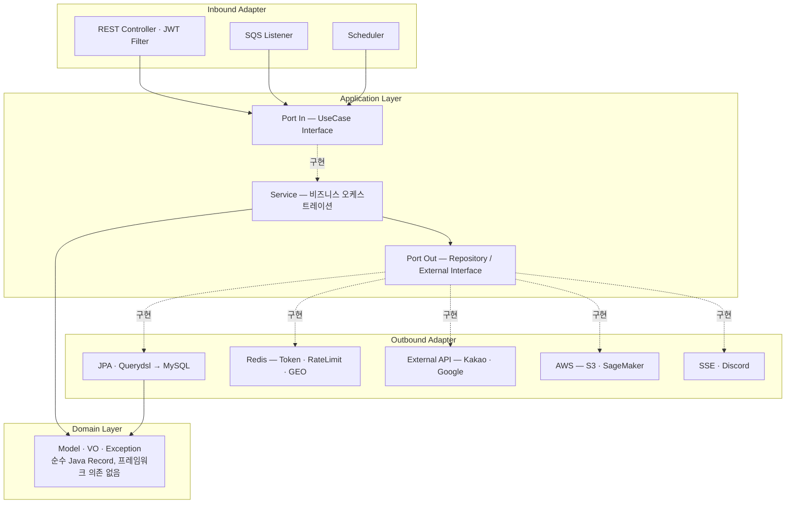
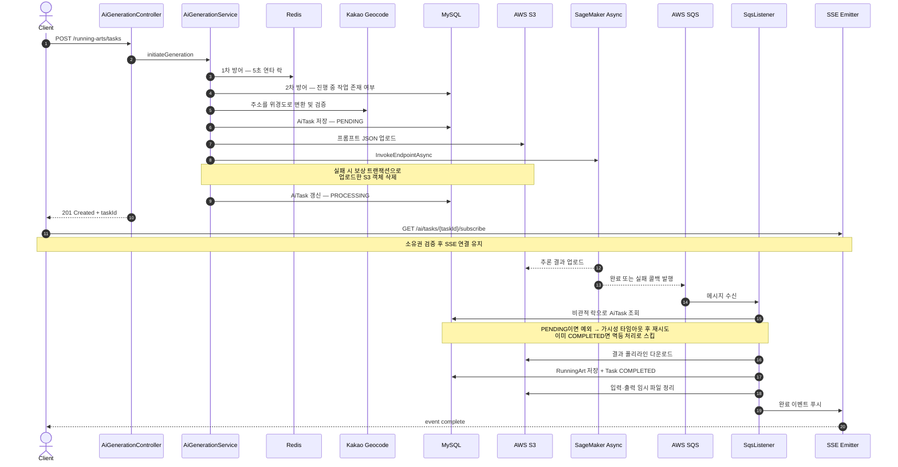

# Aetheria — Server BE

> **GPS 러닝 궤적을 하나의 그림으로 만드는 AI 러닝 아트 코스 생성 서비스의 백엔드 서버**


**담당 범위 — 백엔드 서버 전 영역 단독 설계·구현.** 도메인 모델링, 헥사고날 아키텍처 설계, OAuth2/JWT 인증 인프라, AI 비동기 파이프라인, AWS 연동(S3·SageMaker·SQS), 장애 대응 설계, 테스트 코드까지 전부 직접 작성했습니다.

---

## 목차

- [서비스 소개](#서비스-소개)
- [기술 스택](#기술-스택)
- [아키텍처](#아키텍처)
- [기술적 의사결정 및 트러블슈팅](#기술적-의사결정-및-트러블슈팅)
- [API 명세](#api-명세)
- [프로젝트 구조](#프로젝트-구조)
- [배포](#배포)
- [실행 방법](#실행-방법)
- [테스트](#테스트)

---

## 서비스 소개

사용자가 **출발 지점(주소)**, **그리고 싶은 모양**, **본인의 러닝 숙련도**를 입력하면, AI가 실제로 달릴 수 있는 러닝 코스를 그 모양대로 설계해 돌려줍니다.

서버는 요청을 받는 즉시 `taskId`를 반환하고 실제 추론은 백그라운드에서 진행됩니다. AI 추론이 완료되면 SageMaker가 S3에 결과를 올리고 SQS로 콜백을 보내며, 서버는 이를 소비해 폴리라인을 GPX 코스로 변환·저장한 뒤 **SSE로 클라이언트에 실시간 완료 알림**을 푸시합니다. 완성된 코스는 Redis GEO 인덱스에 등록되어 다른 사용자의 "내 주변 러닝 아트 찾기" 검색 대상이 됩니다.

즉 이 서버의 본질은 **"수 분 단위로 걸리고, 중간에 언제든 실패할 수 있으며, 실패하면 비용이 청구되는 외부 작업"을 안전하게 오케스트레이션하는 것**입니다. 아래 트러블슈팅 섹션은 대부분 이 지점에 대한 기록입니다.

---

## 기술 스택

| 분류 | 사용 기술 |
| --- | --- |
| **Language / Runtime** | Java 17 |
| **Framework** | Spring Boot 3.5.8, Spring MVC, **Spring WebFlux (Reactor)** |
| **Persistence** | Spring Data JPA, Hibernate, **Querydsl 5.0.0 (Jakarta)**, MySQL 8, **Flyway** (스키마 마이그레이션) |
| **Cache / In-Memory** | Redis (Lettuce), **Lua Script**, Redis GEO, Redis Pub/Sub, Caffeine |
| **Auth / Security** | Spring Security, OAuth2 Client (Kakao·Google), **JWT (jjwt 0.11.5)**, AES-GCM 필드 암호화 |
| **Resilience** | **Resilience4j 2.2.0** (Circuit Breaker), Spring AOP, **ShedLock 5.13.0** (Redis Provider) |
| **Cloud** | AWS SDK v2 (BOM 2.24.0) — **S3**, **SageMaker Async Inference**, **SQS** (Spring Cloud AWS 3.1.1) |
| **Realtime** | SSE (`SseEmitter`) + Redis Pub/Sub 기반 다중 인스턴스 브로드캐스트 |
| **Docs / Ops** | SpringDoc OpenAPI 2.8.3 (Swagger UI), Spring Actuator, Discord Webhook 알림 |
| **Test** | JUnit 5, Mockito, AssertJ, Reactor Test, Spring Security Test, **OkHttp MockWebServer** |

---

## 아키텍처

### 헥사고날 아키텍처 (Ports & Adapters)

도메인이 프레임워크·인프라에 의존하지 않도록 계층을 분리했습니다. `domain` 패키지는 **Spring·JPA 애노테이션이 단 하나도 없는 순수 Java Record**로만 구성되어 있으며, 모든 도메인 모델이 불변(Immutable)입니다.



> 의존 방향은 항상 **바깥 → 안쪽**입니다. 어댑터를 교체해도 `application`·`domain`은 수정되지 않습니다.

### AI 생성 파이프라인 시퀀스

가장 복잡한 흐름입니다. **요청 처리**와 **결과 수신**이 완전히 분리된 비동기 구조이며, 각 단계마다 실패 시나리오가 정의되어 있습니다.



> **10분이 지나도 콜백이 오지 않는 좀비 태스크**는 5분 주기 스케줄러가 회수해 `FAILED` 처리하고 클라이언트에 실패 알림을 보냅니다. (`TaskTimeoutScheduler`)

---

## 기술적 의사결정 및 트러블슈팅

아래는 각 문제의 요약입니다. **실제 코드 인용, 검토했다 기각한 대안, 재현·검증 방법**은
[`docs/troubleshooting/`](docs/troubleshooting/)에 항목별 문서로 정리해 두었습니다.

### 1. WebFlux 이벤트 루프 블로킹 — 전 구간 스레드 격리

**문제** · AI 파이프라인은 외부 API 대기 시간이 길어 WebFlux로 구현했지만, 그 안에서 호출하는 JPA·Redis·AWS SDK v2 동기 클라이언트는 전부 **블로킹 I/O**입니다.

**원인** · Netty 이벤트 루프 스레드는 CPU 코어 수만큼만 존재합니다. 이 스레드가 DB 응답을 기다리며 멈추면 **서버 전체의 모든 요청 처리가 함께 멈춥니다.**

**해결** · 파이프라인 내 모든 블로킹 구간을 `Mono.fromCallable(...).subscribeOn(Schedulers.boundedElastic())`으로 감싸 전용 스레드 풀로 격리했습니다. Rate Limit 검증, PENDING 저장, S3 업로드, SageMaker 호출, 상태 갱신, 에러 기록 — 예외 없이 전부 적용했습니다.

> 근거 · [`AiGenerationService.java`](src/main/java/com/serverbe/application/service/AiGenerationService.java)
>
> 자세히 · [리액티브 파이프라인의 블로킹 I/O — 전 구간 스레드 격리](docs/troubleshooting/01-webflux-blocking-io.md)

---

### 2. S3 고아 파일 — Saga 보상 트랜잭션

**문제** · S3 업로드는 성공했는데 직후 SageMaker 호출이 실패하면, 아무도 참조하지 않는 파일이 S3에 영구히 남습니다.

**원인** · S3와 SageMaker는 서로 다른 외부 시스템이라 **하나의 트랜잭션으로 묶을 수 없습니다.** DB 롤백은 이 파일을 지워주지 않으며, 그대로 두면 스토리지 비용으로 누적됩니다.

**해결** · Saga 패턴의 보상 트랜잭션을 적용했습니다. SageMaker 호출 단계에 `onErrorResume`을 걸어 실패 시 방금 올린 S3 객체를 삭제합니다. 이때 **보상 로직 자체가 실패하더라도 원본 예외를 우선 전파**하도록 설계했습니다 — 삭제 실패로 원인 예외가 가려지면 디버깅이 불가능해지기 때문입니다. 삭제 실패 건은 수동 정리가 가능하도록 별도 `ERROR` 로그로 남기고, 추가 안전망으로 S3 Lifecycle 정책(임시 경로 1일 후 자동 만료)을 애플리케이션 기동 시 등록합니다.

> 근거 · [`AiGenerationService.java`](src/main/java/com/serverbe/application/service/AiGenerationService.java) `compensateS3Upload`, [`S3LifecyclePolicyInitializer.java`](src/main/java/com/serverbe/infrastructure/config/S3LifecyclePolicyInitializer.java) · 커밋 `826fe6a`
>
> 자세히 · [S3 고아 파일 — Saga 보상 트랜잭션](docs/troubleshooting/02-s3-orphan-saga-compensation.md)

---

### 3. SQS 콜백 경합 조건 — 비관적 락과 재시도 유도

**문제** · SageMaker 추론이 매우 빨리 끝나면, **완료 콜백이 서버가 `PROCESSING` 상태를 저장하기도 전에 도착**합니다. 리스너는 아직 `PENDING` 상태인 태스크를 보고 실패 처리해 버립니다. 반대로 SQS의 at-least-once 특성 때문에 동일 메시지가 중복 수신되어 러닝 아트가 두 번 저장되는 문제도 있었습니다.

**원인** · 요청 스레드와 SQS 리스너 스레드가 **동일한 `AiTask` 레코드에 순서 보장 없이 접근**하는 전형적인 경합 조건입니다.

**해결**

- 리스너를 `@Transactional`로 묶고 **비관적 락**으로 태스크를 조회해 동시 접근을 직렬화했습니다.
- 상태가 아직 `PENDING`이면 예외를 던져 **SQS 가시성 타임아웃 후 자연스럽게 재시도**되도록 유도했습니다. 이미 `COMPLETED`면 멱등하게 스킵합니다.
- 최종적으로 처리에 실패한 메시지는 예외를 그대로 전파해 **DLQ로 이동**시켜 유실을 방지했습니다.

> 근거 · [`AiNotificationSqsListener.java`](src/main/java/com/serverbe/infrastructure/config/event/AiNotificationSqsListener.java) · 커밋 `51cf87f`, `cae72bf`
>
> 자세히 · [SQS 콜백 경합 조건 — 비관적 락과 재시도 유도](docs/troubleshooting/03-sqs-callback-race-condition.md)

---

### 4. 스케줄러 중복 실행 — ShedLock 분산 락

**문제** · 좀비 태스크 정리 스케줄러가 서버를 2대 이상으로 확장하는 순간 **동시에 실행**되어, 같은 태스크에 대해 실패 알림이 중복 발송되었습니다.

**원인** · `@Scheduled`는 JVM 단위로 동작합니다. 인스턴스가 늘어나면 스케줄러도 그만큼 늘어납니다.

**해결** · Redis Provider 기반 ShedLock을 도입하되, 두 파라미터의 의미를 구분해 설정했습니다.

- `lockAtLeastFor = 4m` — 작업이 1초 만에 끝나 락이 즉시 풀리면, **서버 간 NTP 시계 오차(1~2초)** 로 뒤늦게 트리거된 다른 인스턴스가 중복 실행합니다. 실행 주기(5분)보다 약간 짧게 잡아 이를 차단했습니다.
- `lockAtMostFor = 10m` — 락을 쥔 서버가 OOM 등으로 죽었을 때 **락이 영구히 남는 데드락**을 방지하는 안전장치입니다.

> 근거 · [`TaskTimeoutScheduler.java`](src/main/java/com/serverbe/infrastructure/scheduler/TaskTimeoutScheduler.java) · 커밋 `9423dbb`, `db03584`
>
> 자세히 · [스케줄러 중복 실행 — ShedLock 분산 락](docs/troubleshooting/04-scheduler-duplicate-shedlock.md)

---

### 5. Rate Limiting — Lua 원자적 토큰 버킷과 서킷 브레이커 폴백

**문제** · SageMaker 추론은 **호출 1건당 비용이 발생**합니다. 버튼 연타 한 번이 그대로 요금입니다. 반면 Redis 기반 카운터는 `GET → 계산 → SET` 사이에 다른 요청이 끼어들면 한도를 초과 허용하는 Race Condition이 있습니다.

**해결**

- **원자성** — 토큰 버킷의 조회·리필 계산·갱신을 **단일 Lua 스크립트**로 작성해 Redis 상에서 원자적으로 실행되도록 했습니다. 버스트를 허용하는 `capacity`와 평균 처리율을 결정하는 `refillRate`를 분리해, 잠시 쉬었다 보내는 정상 사용자를 막지 않으면서 지속적인 남용은 차단합니다.
- **다층 방어** — 비용이 발생하는 지점 **이전**에 차단하도록 배치했습니다. 1차는 Redis 5초 연타 방지, 2차는 DB의 "1인 1작업" 규칙 검증. 지오코딩 API 호출조차 이 검증을 통과해야 도달합니다.
- **선언적 적용** — `@RateLimit(target = IP, capacity = 10, refillRate = 5)` 형태의 반복 가능(`@Repeatable`) 애노테이션과 AOP로, 엔드포인트마다 IP·USER 정책을 동시에 걸 수 있게 했습니다.
- **Redis 장애 대응** — Rate Limiter가 죽었다고 서비스 전체가 멈춰선 안 됩니다. Resilience4j 서킷 브레이커로 감싸고, 폴백에서는 **Caffeine 로컬 캐시로 축소된 방어선**을 유지합니다. 사용자 단위는 로컬 카운팅으로 계속 차단하고, IP 단위는 Fail-Open으로 가용성을 우선합니다.

> 근거 · [`token_bucket.lua`](src/main/resources/scripts/token_bucket.lua), [`RateLimiterService.java`](src/main/java/com/serverbe/application/service/RateLimiterService.java), [`RateLimitAspect.java`](src/main/java/com/serverbe/infrastructure/config/aop/RateLimitAspect.java), [`RateLimitFallbackHandler.java`](src/main/java/com/serverbe/application/service/fallback/RateLimitFallbackHandler.java) · 커밋 `2ad20c4`
>
> 자세히 · [Rate Limiting — Lua 원자적 토큰 버킷](docs/troubleshooting/05-rate-limit-lua-token-bucket.md)

---

### 6. Refresh Token Rotation — Lua 원자적 회전과 기기별 세션 관리

**문제** · Refresh Token 재발급은 ① 구 토큰 블랙리스트 등록 ② 신 토큰 저장 ③ 세션 인덱스 갱신 ④ 최대 기기 수 초과분 제거 — **네 개 연산이 전부 성공하거나 전부 실패해야** 합니다. 중간에 끊기면 탈취된 구 토큰이 계속 유효하거나, 정상 사용자가 로그아웃됩니다.

**해결**

- 네 개 연산을 **하나의 Lua 스크립트**로 묶어 원자적으로 실행합니다. 구 토큰의 잔여 TTL(`PTTL`)을 그대로 블랙리스트 TTL로 사용해 불필요한 메모리 점유를 없앴습니다.
- 기기별 세션을 **Redis ZSET**으로 관리해, 최대 동시 로그인 기기 수를 초과하면 가장 오래된 기기부터 자동 만료시킵니다.
- 토큰은 원문이 아닌 **SHA-256 해시**로만 저장하며, 로그아웃·전역 로그아웃도 각각 전용 Lua 스크립트로 처리합니다.

> 근거 · [`rotate_token.lua`](src/main/resources/scripts/rotate_token.lua), [`global_logout.lua`](src/main/resources/scripts/global_logout.lua), [`TokenPersistenceAdapter.java`](src/main/java/com/serverbe/adapter/out/persistence/token/TokenPersistenceAdapter.java) · 커밋 `68428b8`
>
> 자세히 · [Refresh Token Rotation — 원자적 회전과 기기별 세션](docs/troubleshooting/06-refresh-token-rotation.md)

---

### 7. 소셜 계정 중복 가입 — 선언만 있고 실재하지 않던 유니크 제약

**문제** · 유저 엔티티는 처음부터 `(oauth_id, provider)` 유니크 제약을 선언하고 있었지만, **실제 DB에는 그 인덱스가 존재한 적이 없었습니다.** 같은 소셜 계정으로 최초 로그인이 동시에 두 번 들어오면 중복 회원이 생성되고, 한 번 중복 행이 생기면 `findByOauthIdAndProvider`가 `Optional`을 반환하므로 **그 계정은 이후 모든 로그인에서 `NonUniqueResultException`으로 영구히 실패**합니다. 사용자 입장에서는 어느 날 갑자기 로그인이 되지 않고, 재시도로도 절대 복구되지 않습니다.

**원인** · 두 겹입니다.

- `@UniqueConstraint`의 `columnNames`는 자바 필드명이 아니라 **물리 컬럼명**을 받습니다. 필드는 `provider`였지만 컬럼은 `@Column(name = "oauth_provider")`였고, 존재하지 않는 컬럼을 가리킨 제약은 만들어지지 않습니다.
- `ddl-auto: validate`는 테이블·컬럼·타입만 검증하고 **유니크 인덱스는 보지 않습니다.** 그래서 기동 시점에도 드러나지 않았습니다.

그동안 중복을 막아 온 것은 "조회 후 없으면 삽입" 로직뿐이었습니다. 이 패턴은 두 요청이 **동시에 조회 단계를 통과**할 수 있어 그 자체로는 아무것도 보장하지 못합니다.

**해결**

- 컬럼명을 `oauth_provider`로 교정하고 제약에 이름(`uk_users_oauth`)을 명시해, 엔티티 선언과 마이그레이션 DDL이 같은 이름을 가리키도록 했습니다.
- 이미 생긴 중복은 `V3` 마이그레이션으로 정리했습니다. 최초 가입 계정을 남기고 러닝 아트·작업 이력을 그쪽으로 이관한 뒤 중복 행을 삭제합니다. 이때 **이관보다 먼저 잃는 계정의 진행 중 작업을 종결시켜 `V2`의 `active_user_id` 슬롯을 반납시키는 순서가 핵심**입니다 — 두 계정이 각각 진행 중 작업을 갖고 있으면 `user_id`만 옮기는 순간 `uk_ai_task_active_user`에 걸려 이관 자체가 실패합니다.
- 경합에서 진 요청이 500으로 죽지 않도록 복구 경로를 넣었습니다. 신규 등록을 **`REQUIRES_NEW`로 분리**한 것이 요점입니다. 바깥 트랜잭션에 합류시키면 제약 위반이 그 트랜잭션까지 rollback-only로 오염시켜 **뒤이은 재조회 자체가 불가능**해지기 때문입니다. 제약 위반을 잡은 시점에는 이긴 쪽의 행이 이미 커밋되어 있으므로, 재조회 한 번으로 정상 로그인이 완성됩니다.

> 근거 · [`UserEntity.java`](src/main/java/com/serverbe/adapter/out/persistence/user/UserEntity.java), [`V3__add_users_oauth_unique.sql`](src/main/resources/db/migration/V3__add_users_oauth_unique.sql), [`UserDataSyncManager.java`](src/main/java/com/serverbe/application/service/helper/UserDataSyncManager.java)
>
> 자세히 · [소셜 계정 중복 가입 — 실재하지 않던 유니크 제약](docs/troubleshooting/07-oauth-duplicate-account.md)

---

### 8. 5분마다 도는 스케줄러의 숨은 비용 — 풀 스캔과 쓰기 증폭

**문제** · 좀비 태스크 정리 스케줄러는 5분마다 조용히 돕니다. 그런데 이 한 번의 실행이 **테이블 전체를 읽고**, 정리 대상이 N건이면 **문장을 2N개** 내보내고 있었습니다. 종결된 작업(`COMPLETED`·`FAILED`)은 삭제되지 않고 계속 쌓이므로 이 비용은 **서비스 수명에 비례해 증가**합니다. 눈에 띄는 장애가 없어 더 오래 방치되기 쉬운 종류의 비용입니다.

**원인 — 읽기** · `findZombieTasks`의 술어는 `status IN ('PENDING','PROCESSING') AND updated_at < ?` 인데, 이 테이블의 어떤 인덱스도 이 조건을 좁혀 주지 못했습니다.

| 기존 인덱스 | 사용 불가 사유 |
| --- | --- |
| `PRIMARY(id)` | 조건에 `id`가 없음 |
| `uk_ai_task_active_user(active_user_id)` | 조건에 `active_user_id`가 없음 |
| `idx_ai_task_user_status(user_id, status)` | **선두 컬럼이 `user_id`** 라 `status`만으로는 탈 수 없음 |

`EXPLAIN`을 뜨면 `possible_keys`가 `NULL`, `type`이 `ALL`로 나옵니다. 5분마다 풀 스캔을 돌고 있었던 것입니다.

**원인 — 쓰기** · 도메인 모델이 불변 Record라 어댑터의 갱신 경로는 **id로 엔티티를 다시 조회한 뒤** 값을 옮겨 담아 저장합니다. 건별 저장을 반복하면 좀비 1건당 `SELECT` + `UPDATE`, 즉 N건에 문장 2N개가 나갑니다.

**해결 — 읽기** · `(status, updated_at)` 복합 인덱스를 추가했습니다. **컬럼 순서가 핵심**입니다. `status`는 등치 조건(`IN`), `updated_at`은 범위 조건(`<`)이므로 **등치 컬럼이 선두여야** 인덱스가 범위 조건까지 이어서 좁혀 줍니다. 반대로 `(updated_at, status)`로 잡으면 범위 조건에서 인덱스 탐색이 끊깁니다.

**해결 — 쓰기** · 건별 저장을 **단일 벌크 `UPDATE`** 로 바꿨습니다. 스윕은 방치된 작업을 한꺼번에 거두는 일이라 건별 상태 전이가 필요 없고, 문장 하나면 충분합니다. 다만 벌크 JPQL은 ORM을 우회하므로 **세 가지를 직접 챙겨야** 합니다.

- **`active_user_id = NULL`** — 건별 경로에서 `releaseActiveSlot()`이 하던 일입니다. 빠뜨리면 `uk_ai_task_active_user` 슬롯이 점유된 채 남아 **그 사용자는 새 작업을 영영 만들 수 없습니다.** "1인 1작업" 제약이 그대로 족쇄가 됩니다.
- **`updated_at` 수동 갱신** — 벌크 JPQL은 `@LastModifiedDate` 감사를 발동시키지 않습니다. 갱신하지 않으면 **다음 스윕이 같은 행을 또 집습니다.**
- **`clearAutomatically = true`** — 벌크는 영속성 컨텍스트를 우회하므로, 남아 있는 낡은 스냅샷이 이후 dirty checking으로 **방금의 갱신을 되돌릴 수 있습니다.**

도메인 상태 전이(`markAsFailed`) 자체는 그대로 수행합니다. 커밋 이후의 S3 임시 자원 정리와 SSE 실패 알림이 그 결과를 사용하기 때문입니다. 실패 사유 문구는 상수 하나로 모아, 도메인 전이와 벌크 `UPDATE`가 서로 다른 문구를 기록하는 일이 없게 했습니다.

> 근거 · [`V4__add_ai_task_sweep_index.sql`](src/main/resources/db/migration/V4__add_ai_task_sweep_index.sql), [`JpaAiTaskRepository.java`](src/main/java/com/serverbe/adapter/out/persistence/task/JpaAiTaskRepository.java) `markFailedInBulk`, [`AiTaskCleanupService.java`](src/main/java/com/serverbe/application/service/AiTaskCleanupService.java) · 커밋 `64d83ae`
>
> 자세히 · [스케줄러의 숨은 비용 — 풀 스캔과 쓰기 증폭](docs/troubleshooting/08-scheduler-full-scan-and-write-amplification.md)

---

### 9. Hibernate가 만든 스키마와 Flyway가 선언한 스키마의 드리프트

**문제의 뿌리** · Flyway를 도입할 때 기존 DB는 `baseline-on-migrate`로 `V1`을 건너뜁니다. 즉 **기존 환경의 실제 스키마는 `ddl-auto: update` 시절 Hibernate가 만들어 둔 상태 그대로**이고, `V1`이 "선언한" 스키마와는 미묘하게 어긋나 있습니다. 아래 두 문제는 증상이 전혀 달라 보이지만 뿌리가 같습니다.

#### 9-1. 자바 enum에서 사라진 등급이 조회 API 전체를 죽이다

**문제** · `Proficiency` enum에는 `INTRODUCTION` / `BEGINNER` / `SKILLED` / `EXPERT` 넷뿐인데, DB에는 과거에 존재했던 `MASTER` 행이 남아 있었습니다. `@Enumerated(STRING)` 역변환이 `No enum constant Proficiency.MASTER`로 터지므로, **그 행이 결과 집합에 하나라도 걸리면 목록 조회·주변 검색·상세 조회가 전부 예외로 죽습니다.** 특정 데이터가 조회 범위에 들어올 때만 터지기 때문에 재현이 까다롭고, 코드에는 아무 흔적도 남지 않습니다.

**해결 — 데이터** · 행을 지우지 않고 살아있는 등급 중 가장 가까운 `EXPERT`로 옮겼습니다(`MASTER`는 `EXPERT` 위의 최상위 등급이었습니다). 삭제가 아니므로 **Redis GEO 인덱스를 따로 정리할 필요가 없습니다.** `ai_generation_tasks`에는 해당 행이 없었지만 컬럼 정의가 동일하고 다른 환경의 데이터는 확인할 수 없어 방어적으로 함께 처리했습니다.

**해결 — 스키마** · ENUM 정의에서 값을 뺄 때 `ALGORITHM=COPY`를 명시했습니다. MySQL의 ENUM은 **문자열이 아니라 순번으로 저장**되기 때문입니다.

```
BEGINNER=1, EXPERT=2, INTRODUCTION=3, MASTER=4, SKILLED=5
```

가운데의 `MASTER`를 빼면 `SKILLED`가 5번에서 4번으로 밀립니다. `INPLACE`로 처리되어 저장된 순번이 그대로 재해석되면 **`SKILLED` 행이 조용히 다른 등급으로 바뀝니다.** 예외도 로그도 남지 않는 데이터 손상입니다. `COPY`는 테이블을 재작성하며 문자열 값 기준으로 변환하므로 이 사고를 막습니다. MySQL 8은 값 삭제에 `INPLACE`를 허용하지 않아 실질적으로는 `COPY`로 떨어지지만, **의도를 스크립트에 못 박아** 두었습니다.

#### 9-2. 환경마다 이름이 갈리는 FK와 인덱스

**문제** · `V1`은 `fk_running_arts_user`·`idx_running_arts_user`를 선언하지만, 기존 DB에는 Hibernate가 만든 해시 이름 FK와 InnoDB가 그 이름으로 자동 생성한 인덱스만 존재합니다. **신규 환경과 기존 환경의 제약 이름이 서로 다른 상태**이고, 이름이 갈리면 이후 마이그레이션이 대상을 특정할 수 없습니다.

**해결** · 하나의 스크립트가 양쪽 환경에서 모두 돌아야 하므로 `information_schema`를 읽어 **조건부로 DDL을 조립·실행**했습니다. 기존 이름은 환경마다 해시가 다르므로 절대 하드코딩하지 않고 항상 조회해서 조립합니다. 실행 순서에도 이유가 있습니다.

1. **표준 이름 인덱스를 먼저 만든다** — FK가 기댈 인덱스가 남아 있어야 3번에서 낡은 인덱스를 지울 수 있습니다.
2. **FK를 드롭 후 재생성한다** — MySQL은 FK 제약의 이름 변경을 지원하지 않습니다.
3. **남은 낡은 인덱스를 지운다** — FK를 드롭해도 그 이름으로 자동 생성됐던 인덱스는 그대로 남습니다.

조건이 맞지 않을 때의 no-op으로는 `SELECT 1`을 씁니다. `DO`는 `PREPARE`가 받아 주는 문이 아니기 때문입니다.

**재발 방지** · 엔티티 쪽에도 이름을 못 박았습니다. `@Index(name = "idx_running_arts_user")`와 `@JoinColumn(foreignKey = @ForeignKey(name = "fk_running_arts_user"))`를 명시해, 앞으로 만들어지는 스키마는 처음부터 표준 이름을 갖습니다. 드리프트는 한 번 정리하는 것보다 **다시 생기지 않게 막는 쪽**이 중요합니다.

> 근거 · [`V5__drop_master_proficiency_and_normalize_art_keys.sql`](src/main/resources/db/migration/V5__drop_master_proficiency_and_normalize_art_keys.sql), [`RunningArtEntity.java`](src/main/java/com/serverbe/adapter/out/persistence/art/RunningArtEntity.java), [`Proficiency.java`](src/main/java/com/serverbe/domain/model/art/vo/Proficiency.java) · 커밋 `64d83ae`
>
> 자세히 · [스키마 드리프트 — ENUM 순번과 조건부 DDL](docs/troubleshooting/09-schema-drift-flyway-hibernate.md)

---

### 10. 배포하기 전에 잡은 기동 실패 — 자격증명이 없으면 뜨지 않는 SQS 리스너

**계기** · ECS 배포를 붙이기 전에, 운영에 올라갈 것과 **똑같은 `Dockerfile` 이미지**를 로컬에서 먼저 띄워 봤습니다. 당시 GitHub Actions는 `master` 푸시 한 번에 ECR push → ECS 롤링 배포까지 가도록 되어 있었으므로(자동 트리거는 이후 껐습니다), 기동이 안 되면 실패 지점이 CI 로그와 CloudWatch로 흩어집니다.

**문제** · 컨테이너는 Flyway 마이그레이션까지 마친 뒤 **컨텍스트 refresh의 마지막 단계에서** 죽었습니다.

```
io.awspring.cloud.sqs.QueueAttributesResolvingException:
    Error resolving attributes for queue ai-generation-notification-queue with strategy CREATE
Caused by: software.amazon.awssdk.core.exception.SdkClientException:
    Unable to load credentials from any of the providers in the chain ...
```

`AiNotificationSqsListener`의 `@SqsListener`는 `@Profile`이 없어 **모든 프로파일에서 활성화**됩니다. spring-cloud-aws는 리스너 컨테이너를 `SmartLifecycle`로 기동하면서 실제 SQS에 `GetQueueUrl`을 날리는데, 자격증명이 없으면 여기서 애플리케이션 기동 자체가 중단됩니다. `local` 프로파일은 S3·SageMaker를 `FakeS3Adapter`·`FakeSageMakerAdapter`로 가려 주지만, **SQS만 그 그물에서 빠져 있었습니다.**

같은 문제가 테스트에서는 더 나쁜 모양으로 나타났습니다. 리눅스 컨테이너에서는 자격증명 체인이 몇 초 만에 예외로 떨어졌지만, 개발 PC에서 `gradlew integrationTest`를 돌렸을 때는 **15분 넘게 로그 한 줄 없이 멈춰** 있었습니다. 기동 실패보다 무한 대기가 진단하기 훨씬 어렵습니다.

**해결** · 클래스를 `@Profile("prod")`로 막는 선택지는 쓸 수 없었습니다. `AiTestController`가 바로 이 빈을 주입받아 로컬에서 AI 파이프라인을 시뮬레이션하기 때문입니다. 리스너 빈은 살려 두고 **폴링 컨테이너만** 끕니다.

```yaml
spring.cloud.aws.sqs.enabled: ${AWS_SQS_ENABLED:true}
```

이 값이 `false`면 `@SqsListener`를 처리하는 BeanPostProcessor가 아예 등록되지 않아 애노테이션이 무시되고, `@Component` 빈은 그대로 남습니다. 즉 **네트워크를 타는 폴링만 사라지고 비즈니스 로직은 그대로 테스트할 수 있습니다.**

기본값을 `true`로 둔 것이 핵심입니다. 운영(ECS)은 태스크 역할로 자격증명을 받으므로 **아무것도 주입하지 않아도 기존 동작 그대로**이고, CDK가 지키는 환경변수 계약도 바뀌지 않습니다. 끄는 쪽이 명시적인 선택이 되게 해서, 운영에서 조용히 꺼지는 일은 생기지 않습니다. 로컬 컨테이너(`docker-compose.yml`)와 Gradle 테스트 태스크에서만 `AWS_SQS_ENABLED=false`를 줍니다.

**같은 검증에서 함께 나온 것**

- **`mysql:8`은 8.4를 끌고 옴** — Flyway가 "지원이 검증되지 않은 버전" 경고를 냈습니다. 운영 RDS는 `VER_8_0`이므로 로컬도 `mysql:8.0`으로 고정했습니다. 버전이 갈리면 로컬에서 통과한 마이그레이션이 운영에서 다르게 동작할 수 있습니다.
- **스키마는 Flyway가 만들지 않는다** — 마이그레이션 스크립트에 `CREATE DATABASE`가 없습니다. 빈 스키마가 먼저 있어야 하며, 로컬에서는 compose의 `MYSQL_DATABASE`가, 운영에서는 RDS의 `databaseName`이 그 역할을 합니다.
- **컨테이너에는 `.env`가 없다** — `.dockerignore`가 제외합니다(운영 시크릿이 이미지에 구워지면 안 되니까). `application.yml`의 플레이스홀더 중 기본값이 없는 것이 29개라, 하나라도 빠지면 `Could not resolve placeholder`로 기동이 실패합니다. 로컬은 compose의 `env_file`이, 운영은 ECS 태스크 정의가 채웁니다.

**검증 결과** · 빈 볼륨에서 `docker compose up -d --build` 한 번으로 Flyway `V1`~`V5`가 모두 적용되고 Hibernate `validate`를 통과하며, 약 10초 만에 `/actuator/health/alb`가 200을 돌려줍니다. 컨테이너는 비루트 유저(`uid=999(spring)`)로 돕니다.

> 근거 · [`docker-compose.yml`](docker-compose.yml), [`application.yml`](src/main/resources/application.yml), [`AiNotificationSqsListener.java`](src/main/java/com/serverbe/infrastructure/config/event/AiNotificationSqsListener.java)
>
> 자세히 · [배포 전에 잡은 기동 실패 — SQS 리스너](docs/troubleshooting/10-sqs-listener-startup-failure.md)

---

### 그 외 설계 기록

> 각 항목의 배경과 기각한 대안은 [설계 기록 상세](docs/troubleshooting/11-design-notes.md)에 있습니다.

- **트랜잭션 커밋 이후 Redis 반영** — 러닝 아트 삭제 시 DB 삭제와 Redis GEO 삭제를 함께 수행하면, DB가 롤백되어도 Redis 데이터는 이미 사라져 정합성이 깨집니다. `TransactionSynchronization#afterCommit`으로 커밋 성공 이후에만 GEO를 갱신하도록 분리했습니다. ([`RunningArtService.java`](src/main/java/com/serverbe/application/service/RunningArtService.java), 커밋 `14d73c1`)
- **좀비 태스크 실패 알림도 커밋 이후에** — 타임아웃 정리 스케줄러는 상태를 `FAILED`로 바꾸기만 하고 알림을 보내지 않았습니다. 이미 `SseEmitter`를 열고 결과를 기다리던 클라이언트는 아무 이벤트도 받지 못한 채 **자신의 SSE 타임아웃까지 무한 로딩**에 머물렀습니다. S3 임시 자원 정리와 **같은 `afterCommit` 블록**에 실패 알림을 묶었습니다. 커밋 이후여야 하는 이유는 위와 같습니다 — 상태 갱신이 롤백됐는데 클라이언트만 실패 알림을 받으면 SSE 연결이 터미널 상태로 닫혀 되돌릴 수 없습니다. 반대로 알림 발송 실패는 로그만 남기고 삼킵니다. 상태는 이미 커밋되어 되돌릴 수 없고, 한 건의 알림 실패가 나머지 태스크의 마무리까지 중단시켜서는 안 되기 때문입니다. ([`AiTaskCleanupService.java`](src/main/java/com/serverbe/application/service/AiTaskCleanupService.java))
- **서킷 브레이커 오작동 방지** — 외부 API의 4xx는 *우리 요청이 잘못된 것*이고 5xx는 *상대 서버 장애*입니다. 이를 `ExternalApiClientException` / `ExternalApiException`으로 분리하고 4xx를 `ignoreExceptions`에 등록해, 잘못된 주소 입력이 반복될 때 회로가 열려버리는 문제를 막았습니다. 응답 지연으로 인한 스레드 고갈에 대비해 `slowCallRateThreshold`도 함께 설정했습니다. ([`application.yml`](src/main/resources/application.yml))
- **PII 필드 암호화와 무중단 키 교체** — 이메일 등 민감 정보를 JPA `AttributeConverter`로 **AES-GCM 자동 암복호화**합니다. 암호문에 키 버전을 새겨두고, 구버전 키로 암호화된 데이터를 읽으면 마이그레이션 대상으로 표시해 점진적으로 재암호화합니다. ([`CryptoConverter.java`](src/main/java/com/serverbe/adapter/out/persistence/converter/CryptoConverter.java), [`AesGcmEncryptor.java`](src/main/java/com/serverbe/infrastructure/crypto/AesGcmEncryptor.java))
- **DB 커넥션 풀 보호** — AI 결과 처리는 S3 다운로드·삭제, SSE 발송 등 긴 네트워크 I/O를 포함합니다. 메서드 전체에 `@Transactional`을 걸면 그동안 커넥션을 점유해 풀이 고갈됩니다. `TransactionTemplate`으로 **DB 쓰기 구간만** 원자적으로 감싸고 외부 I/O는 트랜잭션 밖으로 뺐습니다. ([`AiResultRetrievalService.java`](src/main/java/com/serverbe/application/service/AiResultRetrievalService.java))
- **준영속 엔티티가 부른 불필요한 SELECT** — 도메인 모델이 불변이라 상태 전이는 항상 "조회 → 값 이관 → 저장"으로 이뤄집니다. 이때 트랜잭션 없이 저장을 호출하면 어댑터의 `findById`가 자기 트랜잭션을 열고 닫아 엔티티가 **준영속** 상태가 되고, 이어지는 저장이 merge를 유발해 **SELECT 두 번 + UPDATE 한 번**이 나갑니다. 상태 전이 구간을 `TransactionTemplate`으로 묶어 조회 결과가 관리 상태로 남도록 했습니다. 반대로 **신규 생성(INSERT) 경로에는 일부러 적용하지 않았습니다** — 그쪽은 `active_user_id` 유니크 위반을 어댑터의 `catch`에서 `DUPLICATE_AI_REQUEST`로 변환하는데, 바깥 트랜잭션이 있으면 위반이 **커밋 시점으로 밀려** 그 `catch`를 그대로 빠져나가기 때문입니다. ([`AiGenerationService.java`](src/main/java/com/serverbe/application/service/AiGenerationService.java))
- **다중 인스턴스 SSE** — SSE 연결은 특정 인스턴스에 고정되지만 완료 이벤트는 다른 인스턴스에서 발생할 수 있습니다. Redis Pub/Sub으로 이벤트를 브로드캐스트해 어느 인스턴스가 받든 올바른 클라이언트에게 전달되도록 했습니다. ([`SseNotificationAdapter.java`](src/main/java/com/serverbe/adapter/out/notification/SseNotificationAdapter.java), [`SseRedisSubscriber.java`](src/main/java/com/serverbe/adapter/out/notification/SseRedisSubscriber.java))
- **스키마 관리를 `ddl-auto`에서 Flyway로 이관** — 동시 요청을 막는 유니크 제약을 추가하면서 `ddl-auto: update`에 맡길 수 없다고 판단했습니다. Hibernate의 `update`는 컬럼 추가는 해주지만 **기존 테이블에 유니크 제약을 붙여준다는 보장이 없고, 새 컬럼에 기존 행을 백필할 수도 없습니다.** 실제로 마이그레이션 대상 DB에는 한 사용자에게 진행 중 작업이 7건 쌓여 있어, 정리 없이는 유니크 인덱스 생성 자체가 실패하는 상태였습니다. `기존 중복 정리 → 컬럼 추가 → 백필 → 제약 생성` 순서를 명시적 SQL로 작성하고 `ddl-auto`는 `validate`로 낮춰, 스키마 변경 권한을 한 곳으로 모았습니다. 이후 소셜 계정 유니크 제약(7번 항목)을 추가할 때도 `기존 중복 정리 → 자식 데이터 이관 → 제약 생성`이라는 같은 순서를 그대로 따랐습니다. ([`V2__add_active_task_slot.sql`](src/main/resources/db/migration/V2__add_active_task_slot.sql), [`V3__add_users_oauth_unique.sql`](src/main/resources/db/migration/V3__add_users_oauth_unique.sql))
- **표준화된 에러 응답** — 도메인별 `ErrorCode` enum과 `BusinessException` 계층을 정의하고 `@RestControllerAdvice`에서 일괄 변환해, 모든 API가 동일한 응답 포맷을 갖도록 했습니다. ([`BusinessExceptionHandler.java`](src/main/java/com/serverbe/infrastructure/error/BusinessExceptionHandler.java), [`RestApiResponse.java`](src/main/java/com/serverbe/infrastructure/common/response/RestApiResponse.java))

---

## API 명세

전체 명세는 서버 실행 후 **Swagger UI (`/swagger-ui.html`)** 에서 확인할 수 있습니다.

### 인증 · 인가 — `/api/v1/auth`

| Method | Endpoint | 설명 | 인증 |
| --- | --- | --- | :---: |
| `GET` | `/login/{provider}` | 소셜 로그인 리다이렉트 (kakao / google) | — |
| `GET` | `/callback/{provider}` | 소셜 로그인 콜백 — 인가 코드로 토큰 발급 | — |
| `POST` | `/reissue` | 토큰 재발급 (Refresh Token Rotation) | Cookie |
| `POST` | `/logout` | 현재 기기 로그아웃 | 필요 |
| `POST` | `/logout/all` | 전역 로그아웃 — 모든 기기 세션 파기 | 필요 |
| `DELETE` | `/me` | 회원 탈퇴 — 소셜 연결 해제 및 데이터 삭제 | 필요 |

### 사용자 — `/api/v1/users`

| Method | Endpoint | 설명 | 인증 |
| --- | --- | --- | :---: |
| `GET` | `/me` | 내 프로필 조회 | 필요 |
| `PATCH` | `/me` | 내 프로필 수정 | 필요 |

### 러닝 아트 — `/api/v1/running-arts`

| Method | Endpoint | 설명 | 인증 |
| --- | --- | --- | :---: |
| `GET` | `/me` | 내 러닝 아트 목록 조회 (페이징) | 필요 |
| `GET` | `/{runningArtId}` | 러닝 아트 단건 상세 조회 | 필요 |
| `PATCH` | `/{runningArtId}` | 러닝 아트 메타데이터 수정 | 필요 |
| `DELETE` | `/{runningArtId}` | 러닝 아트 삭제 | 필요 |
| `DELETE` | `/me` | 내 모든 러닝 아트 삭제 | 필요 |
| `GET` | `/nearby?lat=&lon=&radius=` | 주변 러닝 아트 반경 검색 (Redis GEO) | 필요 |

### AI 생성 작업 — `/api/v1/running-arts/tasks`

| Method | Endpoint | 설명 | 인증 |
| --- | --- | --- | :---: |
| `POST` | `/` | AI 코스 생성 요청 — 즉시 `taskId` 반환 | 필요 |
| `GET` | `/{taskId}` | 작업 진행 상태 폴링 조회 (소유권 검증 포함) | 필요 |

### 실시간 알림 · 부가 기능

| Method | Endpoint | 설명 | 인증 |
| --- | --- | --- | :---: |
| `GET` | `/api/v1/ai/tasks/{taskId}/subscribe` | AI 작업 상태 SSE 구독 (`text/event-stream`) | 필요 |
| `GET` | `/api/v1/geocode` | 주소를 위경도로 변환 (지오코딩) | 필요 |

---

## 프로젝트 구조

```
src/main/java/com/serverbe
├── adapter                      # 외부 세계와의 접점
│   ├── in/web                   # REST 컨트롤러, JWT 필터, 요청·응답 DTO
│   │   ├── filter               # JwtAuthenticationFilter
│   │   └── support              # @ExtractIp, @ExtractDeviceId 등 ArgumentResolver
│   └── out
│       ├── persistence          # JPA 엔티티 · Querydsl · Redis 어댑터 · 매퍼
│       ├── external             # Kakao / Google OAuth·지오코딩, S3, SageMaker
│       └── notification         # SSE Emitter, Redis Pub/Sub 구독자
│
├── application                  # 유스케이스 계층
│   ├── port/in                  # 인바운드 포트 (UseCase 인터페이스)
│   ├── port/out                 # 아웃바운드 포트 (Repository·External 인터페이스)
│   ├── service                  # 유스케이스 구현 — 비즈니스 오케스트레이션
│   │   ├── fallback             # 서킷 브레이커 폴백 핸들러
│   │   └── helper               # 보조 컴포넌트
│   └── annotation               # @RateLimit
│
├── domain                       # 순수 도메인 — 프레임워크 의존 없음
│   ├── model                    # User, RunningArt, AiTask, Address + VO (전부 Record)
│   ├── exception                # 도메인별 ErrorCode / BusinessException 계층
│   └── util                     # PolylineUtils
│
└── infrastructure               # 기술 관심사
    ├── config                   # Bean 설정, @ConfigurationProperties, SQS 리스너
    ├── security                 # SecurityConfig, JwtTokenProvider, JwtKeyManager
    ├── crypto                   # AES-GCM 암호화, 키 버저닝
    ├── scheduler                # 좀비 태스크 정리 스케줄러
    ├── error                    # 전역 예외 핸들러
    └── common                   # 공통 응답 포맷, @Trace / @Timer 로깅 AOP

src/main/resources/scripts       # Redis Lua 스크립트 (토큰 회전·로그아웃·토큰 버킷)
src/main/resources/db/migration  # Flyway 마이그레이션 (V1 베이스라인 → V2 작업 슬롯 → V3 소셜 계정 유니크
                                 #                    → V4 스윕 인덱스 → V5 ENUM·키 정규화)

docs/troubleshooting/            # 트러블슈팅 상세 기록 (항목별 문서 + 인덱스)
infra/                           # AWS CDK (TypeScript) — VPC·RDS·Redis·ECS Fargate·ALB·비동기 파이프라인
Dockerfile                       # 멀티스테이지 빌드 (레이어드 jar)
docker-compose.yml               # 로컬 스택 — MySQL 8.0 · Redis 7 · 위 Dockerfile 로 빌드한 앱
.github/workflows/deploy.yml     # 테스트 → ECR push → ECS 롤링 배포
                                 #   (자동 트리거는 현재 비활성, 수동 실행 전용)
.github/workflows/infra-ci.yml   # infra/** PR → 타입 체크 + CDK 단언 테스트
```

---

## 배포

AWS 인프라는 같은 저장소의 [`infra/`](infra) 에 AWS CDK 로 정의되어 있습니다.
구성도와 백엔드-인프라 간 환경변수 계약은 [`infra/docs/architecture.md`](infra/docs/architecture.md),
실행 방법은 [`infra/README.md`](infra/README.md) 에 있습니다.

**앱 배포와 인프라 배포는 트리거가 분리되어 있습니다.** 앱 배포 워크플로우는 테스트 → 이미지 빌드 →
ECR push → ECS 롤링 배포까지 한 번에 수행하고, VPC·RDS 같은 인프라 변경은 `infra/` 에서 사람이 직접
`cdk deploy` 를 실행합니다. 되돌리기 어려운 리소스를 push 하나로 바꾸지 않기 위한 구분이며,
각 워크플로우의 경로 필터가 이를 강제합니다.

다만 **`master` 푸시 자동 트리거는 현재 꺼 두었습니다.** 실제 추론 엔드포인트가 아직 붙지 않은 단계라
푸시마다 ECS 롤링 배포를 돌릴 이유가 없고, 그만큼 과금만 발생하기 때문입니다. 지금은 Actions 탭에서
`workflow_dispatch` 로 수동 실행만 가능하며, 다시 켜려면 [`deploy.yml`](.github/workflows/deploy.yml) 의
`push:` 블록 주석만 풀면 됩니다.

---

## 실행 방법

### 요구 사항

- Docker Desktop — 이것만 있으면 됩니다
- (직접 실행할 경우) JDK 17 + MySQL 8.0 + Redis 7
- (선택) AWS 계정 — S3 / SageMaker / SQS. **없어도 AI 파이프라인을 제외한 모든 기능이 동작합니다.**

### 1. 환경 변수 설정

```bash
cp .env.example .env   # 이후 아래 표를 참고해 값을 채웁니다
```

| 변수 | 설명 |
| --- | --- |
| `DATABASE_URL` / `DATABASE_USERNAME` / `DATABASE_PASSWORD` | MySQL 접속 정보 |
| `REDIS_HOST` / `REDIS_PORT` | Redis 접속 정보 |
| `REDIS_CONNECT_TIMEOUT` / `REDIS_MAX_POOL` | Lettuce 커넥션 타임아웃 · 풀 크기 |
| `JWT_SECRET` | HS512 서명 키 — **64 byte 이상** 필수 |
| `JWT_REFRESH_TOKEN_COOKIE` | Refresh Token 쿠키 이름 |
| `KAKAO_CLIENT_ID` / `KAKAO_REDIRECT_URI` / `KAKAO_ADMIN_KEY` | 카카오 로그인 및 연결 해제 |
| `GOOGLE_CLIENT_ID` / `GOOGLE_CLIENT_SECRET` | 구글 로그인 |
| `ADDRESS_VERIFICATION_URL` / `ADDRESS_VERIFICATION_KEY` | 지오코딩 API 인증 정보 |
| `ENCRYPTION_ALGORITHM` | 예: `AES/GCM/NoPadding` |
| `ENCRYPTION_SECRET_KEY_V1` / `_V2` | PII 암호화 키(버전별). 활성 버전은 `application.yml`의 `encryption.active-version` |
| `FRONTEND_DOMAIN` / `DEVELOP_SERVER_DOMAIN` / `PROD_SERVER_DOMAIN` | CORS 허용 오리진 |
| `RATE_LIMIT_USER_CAPACITY` / `RATE_LIMIT_USER_REFILL_RATE` | 사용자 단위 토큰 버킷 — 버스트 허용량 / 초당 리필 |
| `RATE_LIMIT_IP_CAPACITY` / `RATE_LIMIT_IP_REFILL_RATE` | IP 단위 토큰 버킷 |
| `AWS_S3_LIFECYCLE_ENABLED` | `true`면 기동 시 S3 임시 경로 만료 정책 자동 등록 (기본 `false`) |
| `DISCORD_WEB_HOOK` | 서킷 브레이커 상태 변화 알림용 Webhook URL |

### 2. Docker로 한 번에 띄우기

```bash
docker compose up -d
docker compose logs -f app
```

[`docker-compose.yml`](docker-compose.yml)이 MySQL 8.0 · Redis 7과 함께 **운영 ECS에 올라가는 것과 똑같은 `Dockerfile`로 빌드한 앱 이미지**를 띄욵니다.
로컬에서 도는 것이 배포되는 것과 같은 산출물이므로, 배포 후에야 드러날 문제를 여기서 먼저 만납니다.

- 앱 컨테이너 안에는 `.env`가 **없습니다**(`.dockerignore`가 제외). compose가 `env_file`로 주입하고,
  접속 주소(`DATABASE_URL` · `REDIS_HOST`)만 컨테이너 네트워크 기준으로 덮어씁니다.
- 호스트에 네이티브 MySQL · Redis가 이미 떠 있는 경우를 고려해 컨테이너는 **3307 · 6380**으로 내보냅니다.
  앱 컨테이너는 compose 네트워크에서 `mysql:3306` · `redis:6379`로 붙으므로 이 매핑과 무관합니다.
- MySQL 이미지는 운영 RDS(`MysqlEngineVersion.VER_8_0`)에 맞춰 `mysql:8.0`으로 고정했습니다.
  `mysql:8` 태그는 8.4를 끌어와 Flyway가 "지원 검증되지 않은 버전" 경고를 냅니다.

### 3. Gradle로 직접 실행

인프라만 컨테이너로 띄우고 앱은 IDE · Gradle에서 돌리는 방식입니다.

```bash
docker compose up -d mysql redis
./gradlew bootRun
```

이때 앱은 `.env`의 `DATABASE_URL` · `REDIS_HOST`를 그대로 따르므로, 위 컨테이너에 붙이려면 **포트를 3307 · 6380으로** 맞춰야 합니다.
`.env`는 애플리케이션이 직접 읽으므로(spring-dotenv) IDE 플러그인 없이도 동일하게 기동됩니다.

### 확인

기동 시 **Flyway가 `src/main/resources/db/migration`의 마이그레이션을 순서대로 적용**하여 스키마를 만듭니다.
Hibernate는 `ddl-auto: validate`로 엔티티와 실제 스키마의 일치 여부만 검증하며, 스키마를 변경하지 않습니다.
단, **`DATABASE_URL`이 가리키는 스키마 자체는 Flyway가 만들지 않습니다.** compose의 `MYSQL_DATABASE`가 빈 스키마를 먼저 만들어 둡니다.

```bash
curl http://localhost:8080/actuator/health/alb        # {"status":"UP"} — ALB가 보는 경로
curl http://localhost:8080/actuator/health            # db · redis · circuitBreakers 상세
```

- Swagger UI — `http://localhost:8080/swagger-ui.html`
- Health Check — `http://localhost:8080/actuator/health` (서킷 브레이커 상태 포함)

### AWS 없이 AI 파이프라인 검증하기

SageMaker·SQS 없이도 결과 수신 이후의 전체 비즈니스 로직(락 획득 → DB 저장 → S3 정리 → SSE 발송)을 확인할 수 있도록, **가짜 SageMaker 알림을 리스너에 직접 주입하는 시뮬레이션 엔드포인트**를 두었습니다.

```
POST /api/v1/test/ai/tasks/{taskId}/mock-sqs-receive
```

> 로컬·개발 환경 전용 도구입니다. ([`AiTestController.java`](src/main/java/com/serverbe/adapter/in/web/AiTestController.java))

---

## 테스트

```bash
./gradlew test              # 단위 테스트 — 외부 인프라 불필요
./gradlew integrationTest   # 통합·성능 테스트 — 로컬 MySQL·Redis 필요
```

실제 인프라가 있어야 하는 테스트는 `@Tag("integration")`으로 분리해 기본 `test` 태스크에서 제외했습니다.
덕분에 레포를 클론한 직후, DB나 Redis 없이도 `./gradlew build`가 통과합니다.
이 그룹에는 `ServerBeApplicationTests`(컨텍스트 기동과 함께 Flyway 마이그레이션 적용 + Hibernate `validate` 검증), `BlacklistPerformanceTest`, `RateLimiterServiceConcurrencyTest`, `NotificationServiceTest`가 속합니다.

두 태스크 모두 `AWS_SQS_ENABLED=false`를 주입합니다. `@SqsListener`는 컨텍스트 기동 중 실제 SQS로 `GetQueueUrl`을 날리기 때문에,
자격증명이 없는 개발 PC와 CI 러너에서는 이것 없이 컨텍스트가 아예 뜨지 않습니다
([트러블슈팅 10번](#10-배포하기-전에-잡은-기동-실패--자격증명이-없으면-뜨지-않는-sqs-리스너)).

> `NotificationServiceTest`는 `DISCORD_WEB_HOOK`으로 **실제 아웃바운드 요청을 보냅니다.** 채널에 메시지를 남기고 싶지 않다면
> `./gradlew integrationTest --tests "com.serverbe.ServerBeApplicationTests" --tests "com.serverbe.BlacklistPerformanceTest" --tests "com.serverbe.RateLimiterServiceConcurrencyTest"` 로 골라 실행하세요.

단순 CRUD 검증보다 **실패 경로와 동시성 검증**에 무게를 두었습니다.

| 유형 | 내용 |
| --- | --- |
| **서비스 단위 테스트** | 로그인·로그아웃·재발급·탈퇴, AI 생성/결과 수신/좀비 정리, 러닝 아트 CRUD와 소유권 검증 — 성공 경로뿐 아니라 각 단계의 예외 분기와 보상 로직 동작을 함께 검증. 좀비 정리는 실패 알림 발송과 알림 실패 시의 견고성까지 확인 |
| **쿼리 비용 회귀 방지** | `AiTaskCleanupServiceTest` — 좀비 정리가 건별 저장이 아니라 **벌크 UPDATE를 정확히 1회** 호출하고 대상 id가 빠짐없이 담기는지, 정리 대상이 없으면 DB 호출 자체가 발생하지 않는지 검증. 성능 개선이 다음 리팩터링에서 조용히 되돌아가는 것을 막는 장치 |
| **경합 복구 테스트** | `UserDataSyncManagerTest` — 동시 최초 로그인으로 유니크 제약에 걸린 요청이 500이 아니라 재조회를 통해 정상 로그인으로 마무리되는지, 복구 불가능한 무결성 위반은 그대로 전파되는지 검증 |
| **외부 연동 테스트** | OkHttp `MockWebServer`로 Kakao·Google OAuth와 지오코딩 API의 정상 응답, 4xx, 5xx, 타임아웃 시나리오를 재현 |
| **동시성 테스트** | `RateLimiterServiceConcurrencyTest` — 다중 스레드가 동시에 요청할 때 Lua 토큰 버킷이 한도를 초과 허용하지 않는지 검증 |
| **성능 측정** | `BlacklistPerformanceTest`, `WebClientPerformanceTest` — 토큰 블랙리스트 조회 및 WebClient 커넥션 풀 동작 특성 측정 |
| **인프라 테스트** | 서킷 브레이커 상태 전이 이벤트, AES-GCM 암복호화와 키 버전 마이그레이션, `@RateLimit` AOP 적용, S3 Lifecycle 정책 등록 |

---

## 개발 프로세스

- 이슈 기반 브랜치 전략 — 이슈 생성 시 GitHub Actions가 `feature/{issue-number}` 브랜치를 자동 생성
- `master` ← `develop` ← `feature/*` 흐름, 모든 병합은 Pull Request 리뷰를 거침
- 기능 구현 / 리팩토링 / 버그 리포트 / 테스트 / 문서화 5종 이슈 템플릿 운영
- 모든 public 클래스·메서드에 `@responsibility`, `@implSpec`, `@implNote` 태그를 활용한 Javadoc 작성 — **"무엇을"보다 "왜 이렇게"를 남기는 것**을 원칙으로 함
