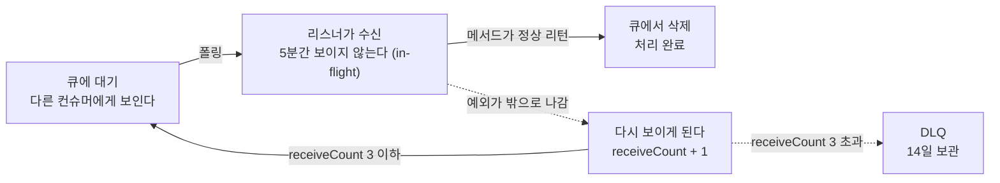
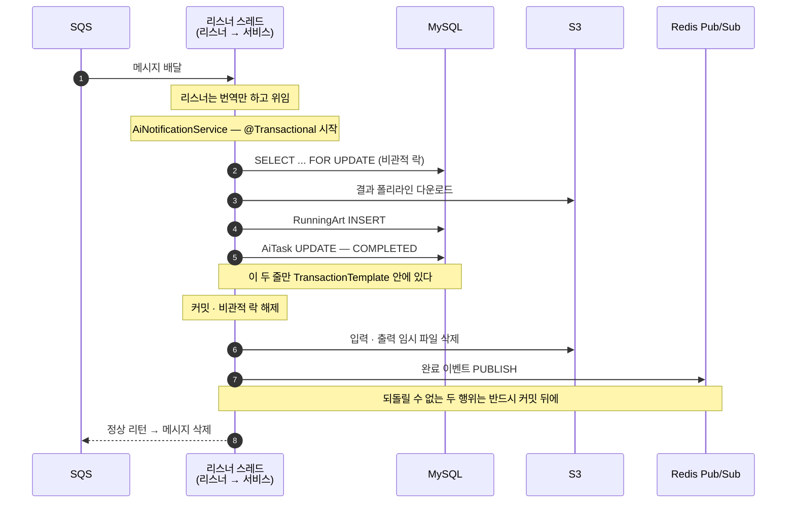
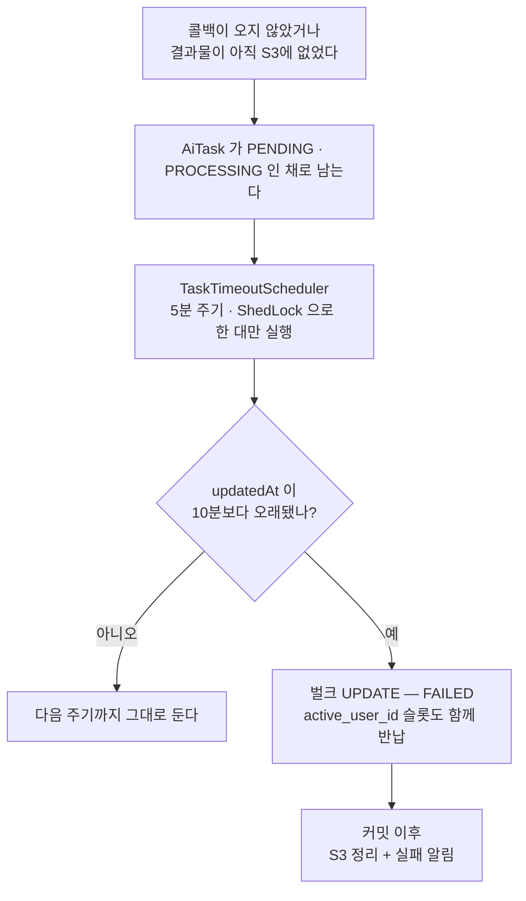

# SQS 메시지 흐름 — 콜백 한 건이 지나가는 길

> 관련 · [3. SQS 콜백 경합 조건](../troubleshooting/03-sqs-callback-race-condition.md) ·
> [10. 배포 전에 잡은 기동 실패](../troubleshooting/10-sqs-listener-startup-failure.md) ·
> [12. 왜 Kafka가 아닌가](../troubleshooting/12-why-not-kafka.md)

이 서버에서 SQS는 **AI 추론이 끝났다는 사실을 전달받는 통로** 하나뿐입니다. 그런데 그 통로 위에
경합 방어, 멱등 처리, 재시도, DLQ, 트랜잭션 경계가 모두 얹혀 있어서 코드만 따라가면 순서가 잘
보이지 않습니다. 이 문서는 **콜백 메시지 한 건이 도착해서 사라질 때까지**를 그림으로 따라갑니다.

가장 먼저 알아야 할 전제가 하나 있습니다.

> **이 서버는 SQS에 메시지를 넣지 않습니다.** `SqsTemplate`도 `sendMessage` 호출도 코드에 없습니다.
> 넣는 쪽은 SageMaker이고, 인프라에서도 백엔드 역할에 `sqs:SendMessage` 권한을 주지 않습니다.
> 왜 그런 구조가 됐는지는 [12번 문서](../troubleshooting/12-why-not-kafka.md)에,
> 큐·토픽·DLQ의 실제 설정값은 [`infra/docs/architecture.md`](../../infra/docs/architecture.md)에 있습니다.

---

## 1. 한눈에 — 어느 클래스가 어디에 서 있나

`README.md`와 `infra/docs/architecture.md`의 그림이 AWS 리소스를 기준으로 그려져 있는 것과 달리,
여기서는 **우리 코드의 클래스**를 기준으로 같은 경로를 다시 그립니다. 어느 파일을 열어야 하는지
찾는 데 쓰는 지도입니다.

```mermaid
flowchart LR
    subgraph REQ["① 요청을 받는 쪽 (HTTP 스레드)"]
        GEN["AiGenerationService<br/>initiateGeneration"]
    end

    SM["SageMaker<br/>Async Inference"]
    SNS["SNS 성공 · 실패 토픽 2개"]
    Q["SQS<br/>aetheria-ai-notifications"]
    DLQ["DLQ<br/>aetheria-ai-notifications-dlq"]

    subgraph RES["② 결과를 받는 쪽 (리스너 스레드)"]
        LIS["AiNotificationSqsListener<br/>adapter.in.messaging — 번역만"]
        SVC["AiNotificationService<br/>application — 처리 규칙"]
        RET["AiResultRetrievalService"]
        PUB["SseRedisPublishAdapter<br/>adapter.out — 발행"]
    end

    subgraph SSE["③ 알림을 내보내는 쪽 (어느 인스턴스든)"]
        SUB["SseRedisMessageListener<br/>adapter.in.messaging — 수신"]
        REG["SseEmitterRegistry<br/>adapter.in.web.sse — 커넥션 보관"]
    end

    CLI["브라우저<br/>SSE 구독 중"]

    GEN -- "inferenceId = taskId" --> SM
    SM -- "결과 알림" --> SNS
    SNS -- "raw 전송 구독" --> Q
    Q -- "폴링" --> LIS
    LIS -- "AiNotificationCommand" --> SVC
    SVC --> RET
    RET --> PUB
    PUB -- "Redis Pub/Sub" --> SUB
    SUB --> REG --> CLI
    Q -. "3회 실패" .-> DLQ
```



> ①과 ②가 **서로 다른 스레드**라는 점이 이 문서 전체의 배경입니다. ①이 아직 일을 마치지
> 않았는데 ②가 먼저 도착할 수 있고, 그것이 2장에서 다룰 `PENDING` 분기의 원인입니다.
> ③은 **다른 인스턴스일 수도 있습니다** — SSE 연결은 특정 인스턴스 메모리에 고정되는데 콜백은
> 아무 인스턴스나 받기 때문이고, 그래서 그 사이에 Redis Pub/Sub이 들어갑니다
> ([설계 기록 7번](../troubleshooting/11-design-notes.md#7-다중-인스턴스-sse)).

**리스너와 서비스가 나뉘어 있는 것**도 함께 봐 두면 좋습니다. 큐에서 올라온
`SageMakerNotificationDto`는 리스너 밖으로 나가지 않습니다. 리스너는 대상 작업을 특정해
`AiNotificationCommand`로 옮기는 **번역**만 하고, 아래 2장의 분기는 전부 애플리케이션 계층의
`AiNotificationService`가 판단합니다. 6장의 로컬 시뮬레이션이 큐 없이도 같은 분기를 그대로 태울 수
있는 것이 이 경계 덕분입니다.

`inferenceId`에 우리 `taskId`를 그대로 실어 보내는 것이 요점입니다. SageMaker가 성공·실패 알림
양쪽에 이 값을 되돌려 주므로, 결과물 S3 경로가 없는 실패 알림에서도 대상 작업을 특정할 수 있습니다.

---

## 2. 메시지 하나가 들어오면

이 문서에서 가장 중요한 그림입니다. `AiNotificationSqsListener.receiveAiTaskNotification`이 번역해
넘긴 명령을 `AiNotificationService.handleNotification`이 어떻게 가르는지 전부 펼치고,
**각 갈래 끝에서 메시지가 어떻게 되는지**를 함께 표시했습니다. 위쪽 상자 밖으로 나가는 화살표가
두 클래스의 경계이며, 그 선을 넘는 것은 `AiNotificationCommand` 하나뿐입니다.

```mermaid
flowchart TD
    subgraph AD["리스너 — adapter.in.messaging"]
        MSG["메시지 도착<br/>SageMakerNotificationDto"]
        EXT["extractTaskId<br/>inferenceId 우선 · 없으면 S3 경로에서 복원"]
        CMD["AiNotificationCommand<br/>taskId · completed · failureReason"]
    end

    LOCK["findByIdForUpdate<br/>비관적 락으로 AiTask 조회"]
    NF{"행이 있는가?"}
    ST{"상태는?"}
    KIND{"메시지 종류는?"}

    NOTFOUND["DataIntegrityViolationException"]
    RACE["AsyncRaceConditionException"]
    SKIP["재처리하지 않음<br/>단 고아 결과물은 정리한다"]
    OK["processTaskResult<br/>결과 등록 파이프라인"]
    INFFAIL["handleInferenceFailure<br/>FAILED 저장 · 정리 · 실패 알림"]

    ACK(["ack — 큐에서 삭제된다"])
    RETRY(["ack 안 함 — 5분 뒤 다시 배달된다"])
    TODLQ(["ack 안 함 — 3회 후 DLQ로 격리된다"])

    MSG --> EXT --> CMD --> LOCK --> NF
    NF -- "없음" --> NOTFOUND
    NF -- "있음" --> ST
    ST -- "PENDING<br/>요청 스레드가 아직 PROCESSING 을 저장하지 못했다" --> RACE
    ST -- "COMPLETED · FAILED<br/>중복이거나 뒤늦게 온 메시지" --> SKIP
    ST -- "PROCESSING" --> KIND
    KIND -- "Completed" --> OK
    KIND -- "Failed" --> INFFAIL

    OK --> ACK
    INFFAIL --> ACK
    SKIP --> ACK
    RACE -.-> RETRY
    NOTFOUND -.-> TODLQ
```



**`PENDING`일 때 아무것도 저장하지 않고 예외를 던지는 것**이 이 설계의 핵심입니다. 추론이 아주 빨리
끝나면 콜백이 요청 스레드보다 먼저 도착할 수 있는데, 그때 실패로 확정해 버리면 정상 작업이 죽습니다.

```java
// [경합 조건 방어] 메인 스레드가 아직 PROCESSING으로 상태를 업데이트하지 못했다면 재시도를 유도합니다.
if (task.isPending()) {
    throw new AsyncRaceConditionException(
            ServerErrorCode.ASYNC_RACE_CONDITION,
            String.format("Task [%s] 가 아직 PENDING 상태입니다. ...", task.id())
    );
}
```

> [`AiNotificationService.java`](../../src/main/java/com/serverbe/application/service/AiNotificationService.java)

반대로 이미 끝난 작업(`COMPLETED`·`FAILED`)에 콜백이 또 오면 **재처리는 막되 S3 정리는 수행합니다.**
SQS는 at-least-once라 같은 메시지가 두 번 올 수 있고, 그때 결과물을 두 벌 저장하면 안 되지만
뒤늦게 생성된 고아 파일은 지워야 비용이 새지 않기 때문입니다.

---

## 3. 왜 "예외를 던지는 것"이 재시도인가

2장의 두 예외 갈래를 이해하려면 큐 쪽에서 무슨 일이 일어나는지를 봐야 합니다.



리스너 메서드가 **정상 리턴하면 삭제, 예외를 던지면 삭제되지 않습니다.** 삭제되지 않은 메시지는
가시성 타임아웃(5분)이 지나면 큐에 다시 나타나고, 그것이 곧 재시도입니다. 여기서 말하는 예외는
대부분 서비스에서 올라온 것이고, 리스너는 그것을 **잡지 않고 그대로 통과시키는 일**을 합니다.

```ts
this.notificationQueue = new sqs.Queue(this, 'RequestQueue', {
  queueName: 'aetheria-ai-notifications',
  // 리스너가 아직 PENDING 인 태스크를 만나면 일부러 예외를 던져 가시성 타임아웃 뒤 재시도를 유도한다.
  // 이 값이 너무 짧으면 재시도가 몰리고, 실제 처리 시간보다 짧으면 같은 메시지가 중복 처리된다.
  visibilityTimeout: cdk.Duration.minutes(5),
  retentionPeriod: cdk.Duration.days(4),
  enforceSSL: true,
  deadLetterQueue: {
    queue: this.deadLetterQueue,
    maxReceiveCount: 3,
  },
});
```

> [`infra/lib/app-stack.ts`](../../infra/lib/app-stack.ts)

**우리 코드에는 재시도 상태도, 백오프 계산도, 재시도 스케줄러도 없습니다.** 큐 설정이 그 역할을
대신합니다. `AiNotificationService`의 `catch` 블록이 로그만 남기고 예외를 전부 다시 던지는 것도,
리스너에 `try`가 아예 없는 것도 이 때문입니다 — 어느 쪽이든 삼키는 순간 메시지가 조용히 삭제되어
유실됩니다.

이것이 [12번 문서](../troubleshooting/12-why-not-kafka.md)가 말하는 **의미가 새는 지점**입니다.
클래스는 나뉘었지만 "예외를 던지면 5분 뒤 다시 온다"는 계약은 여전히 큐의 것이고, 그래서 위 유스케이스
인터페이스의 javadoc은 시그니처가 아니라 **예외를 삼키지 말라는 규약**을 적어 두고 있습니다.

그래서 "재시도로 풀리는가"와 "DLQ로 가는가"는 **예외 종류가 아니라 원인이 저절로 해소되는지**로
갈립니다. `PENDING` 경합은 5분 뒤면 대개 해소되지만, DB에 행이 아예 없는 상태는 몇 번을 다시 읽어도
같으므로 3회 만에 DLQ로 격리됩니다.

---

## 4. 트랜잭션은 어디서 시작하고 정리는 언제 하나

성공 경로를 시간 순서로 폈습니다. 눈여겨볼 곳은 **커밋 선(線)의 위치**입니다.



```java
private void handleSuccess(AiTask aiTask, AiGenerationResultDto resultDto) {
    // 1. 핵심 비즈니스 로직 (TransactionTemplate으로 원자성 보장)
    ProcessResult processResult = transactionTemplate.execute(status -> {
        Long artId = saveArt(aiTask, resultDto);
        AiTask task = updateTask(aiTask, artId);
        return new ProcessResult(artId, task);
    });

    // 2. 부가 로직 (외부 I/O이므로 트랜잭션 블록 밖에서 안전하게 실행)
    resourceCleaner.cleanUp(processResult.updatedTask());
    sendCompletionNotification(processResult.updatedTask(), processResult.savedArtId());
}
```

> [`AiResultRetrievalService.java`](../../src/main/java/com/serverbe/application/service/AiResultRetrievalService.java)

**S3 삭제와 SSE 알림이 커밋 뒤에 있는 이유** — 둘 다 되돌릴 수 없습니다. 트랜잭션이 롤백됐는데
파일만 먼저 지워지면 작업은 살아 있는데 결과물이 사라지고, 알림만 먼저 나가면 클라이언트의 SSE
연결이 완료 상태로 닫혀 버립니다. 리스너 쪽 정리도 같은 이유로
`TransactionSynchronization#afterCommit`에 등록되어 있습니다.

**정확히 짚어 둘 것이 하나 있습니다.** 트랜잭션을 여는 것은 리스너가 아니라
`AiNotificationService.handleNotification`입니다. 비관적 락 조회와 `afterCommit` 등록이 한 경계 안에
있어야 하고, 그 범위는 전송 수단이 아니라 처리 규칙이 정해야 하기 때문입니다. 그래서
`AiResultRetrievalService`의 `TransactionTemplate`은 새 트랜잭션을 여는 것이 아니라
**그 바깥 트랜잭션에 합류합니다.** 즉 위 그림의 S3 다운로드도 비관적 락을 쥔 채 일어납니다.
좁은 경계가 온전히 효과를 내는 것은 이 서비스가 알림 처리 밖에서 호출될 때이며,
이 점은 서비스 클래스의 javadoc에도 명시되어 있습니다.

실패했을 때는 방향이 반대입니다. 결과 등록 중 예외가 나면 바깥 트랜잭션이 이미 rollback-only로
오염되어 있으므로, `FAILED` 기록만은 `PROPAGATION_REQUIRES_NEW`인 별도 트랜잭션으로 분리해
저장합니다. 그러지 않으면 **실패가 아무 데도 남지 않은 채 사라집니다.**

---

## 5. 콜백이 영영 오지 않으면

메시지가 ack됐다고 해서 작업이 끝났다는 뜻은 아닙니다. 구멍이 두 군데 있습니다.

- **결과물이 아직 S3에 없는 경우** — `downloadOutput`이 `Optional.empty()`를 돌려주면
  `processTaskResult`는 **예외 없이 조용히 리턴합니다.** 메시지는 정상 ack되고 작업은 `PROCESSING`인
  채로 남습니다.
- **알림이 아예 오지 않는 경우** — SageMaker나 SNS 쪽에서 유실되면 리스너는 아무 일도 겪지 않습니다.
  시간이 트리거인 회수 장치가 따로 있어야 하는 이유이고, 그래서 `TaskTimeoutScheduler`도 인프라가
  아니라 리스너와 같은 `adapter.in`에 서 있습니다.

둘 다 큐가 해결해 주지 못하므로 별도의 회수 장치가 있습니다.



임계값 10분은 하드코딩이 아니라 `application.yml`의 `task.task-timeout-threshold-minutes`에서
`TaskProperties`를 거쳐 흘러옵니다. 스케줄러가 여러 대에서 동시에 도는 것은 ShedLock이 막습니다
(`lockAtLeastFor = 4m`으로 시계 오차에 의한 중복 실행을, `lockAtMostFor = 10m`으로 락이 영구히
남는 데드락을 막습니다 — 방향이 서로 반대인 두 파라미터입니다).

`active_user_id`를 함께 비우는 것이 중요합니다. 이 컬럼이 "1인 1작업" 유니크 제약의 슬롯이라,
반납하지 않으면 그 사용자는 새 작업을 영영 만들 수 없습니다.

---

## 6. 로컬에서는 SQS가 돌지 않습니다

처음 저장소를 띄우면 반드시 부딪히는 지점이라 미리 적어 둡니다.

`AWS_SQS_ENABLED=false`이면 `@SqsListener`를 처리하는 BeanPostProcessor가 아예 등록되지 않아
**폴링만 사라지고 `@Component` 빈은 그대로 남습니다.** `docker-compose.yml`과 Gradle 테스트 태스크가
이 값을 `false`로 주는데, 자격증명 없이 폴링을 켜면 기동 자체가 중단되기 때문입니다.

그래서 로컬에서는 큐를 거치지 않고 **유스케이스를 직접 부릅니다.**
`AiTestController`(`@Profile({"local", "dev"})`)의
`POST /api/v1/test/ai/tasks/{taskId}/mock-sqs-receive`가 그 통로이며, 더미 `AiNotificationCommand`를
만들어 `HandleAiNotificationUseCase`에 넘깁니다. 큐만 없을 뿐 2장 이후의 분기는 전부 그대로
실행되므로 파이프라인 검증에는 충분합니다.

예전에는 이 컨트롤러가 SQS 리스너 빈을 주입받아 그 메서드를 직접 호출했습니다. 인바운드 웹 어댑터가
다른 인바운드 어댑터를 붙잡는 구조라, 가짜 `SageMakerNotificationDto`를 만들어 내는 코드까지
컨트롤러에 있었습니다. 지금은 두 진입점이 **같은 포트 앞에서 만나고**, 어느 쪽도 상대를 알지 않습니다.

배경과 그때 겪은 기동 실패는
[10번 문서](../troubleshooting/10-sqs-listener-startup-failure.md)에 있습니다.

---

## 7. 더 파고들 곳

| 궁금한 것 | 문서 |
| --- | --- |
| `PENDING` 경합이 실제로 어떤 순서로 벌어지는가 | [3. SQS 콜백 경합 조건](../troubleshooting/03-sqs-callback-race-condition.md) |
| 자격증명이 없으면 왜 기동이 멈추는가 | [10. 배포 전에 잡은 기동 실패](../troubleshooting/10-sqs-listener-startup-failure.md) |
| 왜 Kafka가 아니라 SQS인가 | [12. 메시지 브로커 선택](../troubleshooting/12-why-not-kafka.md) |
| 큐 · 토픽 · DLQ의 실제 설정값과 IAM 권한 | [`infra/docs/architecture.md`](../../infra/docs/architecture.md) |
| 분기별로 무엇을 검증하고 있는가 | [`AiNotificationServiceTest`](../../src/test/java/com/serverbe/application/service/AiNotificationServiceTest.java) |
| Task ID 특정과 예외 전파를 무엇이 지키는가 | [`AiNotificationSqsListenerTest`](../../src/test/java/com/serverbe/adapter/in/messaging/AiNotificationSqsListenerTest.java) |
| 계층 경계가 어떻게 고정되어 있는가 | [`LayerDependencyTest`](../../src/test/java/com/serverbe/architecture/LayerDependencyTest.java) |
