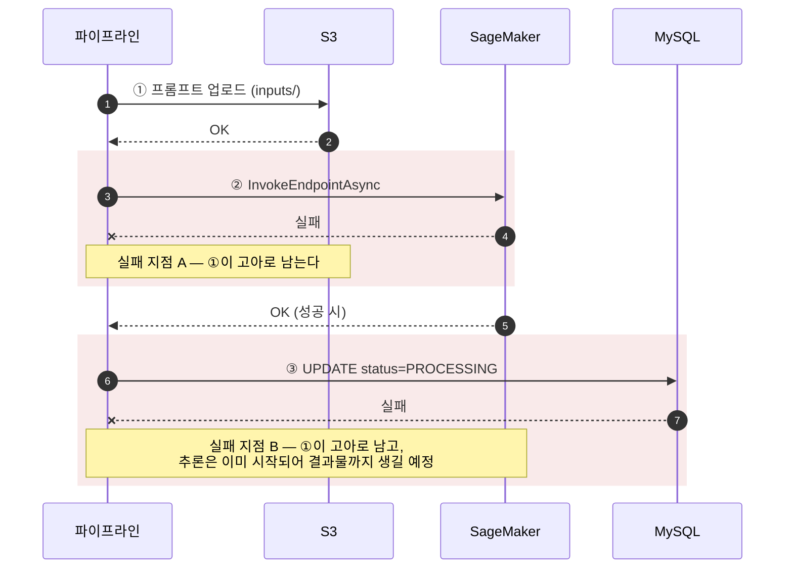

# 2. S3 고아 파일 — Saga 보상 트랜잭션

> 요약 · [README — 2. S3 고아 파일](../../README.md#2-s3-고아-파일--saga-보상-트랜잭션)
> 근거 · [`AiGenerationService.java`](../../src/main/java/com/serverbe/application/service/AiGenerationService.java) · [`AiTaskResourceCleaner.java`](../../src/main/java/com/serverbe/application/service/helper/AiTaskResourceCleaner.java) · [`S3LifecyclePolicyInitializer.java`](../../src/main/java/com/serverbe/infrastructure/config/S3LifecyclePolicyInitializer.java)
> 커밋 · `826fe6a`

## 1. 상황

AI 생성 요청 한 건은 서로 다른 시스템 세 곳에 흔적을 남깁니다.

1. **S3** — 프롬프트 JSON을 `inputs/`에 업로드
2. **SageMaker** — 비동기 추론 호출 (결과는 나중에 `outputs/`에 기록됨)
3. **MySQL** — 작업 상태를 `PROCESSING`으로 갱신

이 셋은 **하나의 트랜잭션으로 묶을 수 없습니다.** DB 롤백은 S3 객체를 지워 주지 않고, S3에는 애초에
롤백이라는 개념이 없습니다.

## 2. 증상

눈에 보이는 장애가 없습니다. 그래서 더 나쁩니다.

S3 버킷의 `inputs/` 아래에 **아무도 참조하지 않는 JSON이 계속 쌓입니다.** 작업은 실패로 끝났으니 DB에는
그 파일을 가리키는 정보가 없고, 결국 사람이 콘솔을 열어 하나하나 대조하지 않으면 어떤 파일이 고아인지
알 수조차 없습니다. 비용은 조용히, 시간에 비례해 증가합니다.

## 3. 원인

실패 지점이 하나가 아니라 **두 개**이고, 각각 남기는 찌꺼기가 다릅니다.



**지점 A**는 단순합니다. 추론이 시작되지 않았으니 지울 것은 입력 파일 하나입니다.

**지점 B**가 까다롭습니다. 이 시점에는 추론이 **이미 시작되어 있습니다.** 입력 파일은 지울 수 있지만,
결과물은 아직 생성되지 않았을 수 있고 **우리가 정리를 마친 뒤에 SageMaker가 기록할 수도** 있습니다.
지점 B에서 결과물까지 완전히 정리하는 것은 원리적으로 불가능합니다.

## 4. 검토한 대안

| 대안 | 기각 이유 |
| --- | --- |
| S3 Lifecycle 정책만으로 해결 | 만료 최소 단위가 1일이라 그동안 비용이 계속 발생하고, 무엇보다 **정리 책임이 애플리케이션 밖으로 나가** 코드만 봐서는 자원이 언제 사라지는지 알 수 없게 됩니다. 최종 방어선으로는 쓰되 1차 수단으로는 부적합합니다. |
| 2단계 커밋(2PC) | S3와 SageMaker는 XA 트랜잭션 참여자가 아닙니다. 선택지가 아닙니다. |
| DB에 "정리 대기" 테이블을 두고 배치로 청소 | 정리 대상을 기록하는 것 자체가 DB 쓰기이고, 그 쓰기가 실패하는 경우를 또 처리해야 합니다. 문제를 한 단계 미룰 뿐입니다. 이미 좀비 태스크 스윕이 있으므로 스케줄러를 하나 더 만들 이유도 없습니다. |
| 업로드를 SageMaker 호출 **이후로** 미룬다 | SageMaker 비동기 추론은 **S3에 올라간 입력 파일의 URI를 인자로** 받습니다. 순서를 뒤집을 수 없습니다. |
| 보상 실패 시 예외를 던져 상위에 알린다 | 원본 예외가 가려집니다. "SageMaker가 왜 실패했는가"를 잃고 "S3 삭제가 실패했다"만 남으면 디버깅이 불가능해집니다. (아래 5-1) |

## 5. 해결

Saga 패턴의 **보상 트랜잭션**을 두 지점 각각에 배치했습니다.

### 5-1. 지점 A — `compensateS3Upload`

```java
private Mono<AiTask> compensateS3Upload(String inputS3Uri, Throwable originalError) {
    log.warn("[Compensation] SageMaker 호출 실패. S3 찌꺼기 파일 삭제 시도: {}", inputS3Uri);

    return Mono.fromRunnable(() -> s3AiInputPort.deleteInputFile(inputS3Uri))
            .subscribeOn(Schedulers.boundedElastic())
            .onErrorResume(deleteError -> {
                // 보상 로직(S3 삭제)마저 실패할 최악의 경우, 로그만 남기고 원본 에러를 우선시합니다.
                log.error("[Compensation Error] S3 파일 삭제 실패 (수동 정리 필요): {}", inputS3Uri, deleteError);
                return Mono.empty();
            })
            // 삭제가 성공하든 실패하든, 결국 작업은 실패한 것이므로 원래 발생했던 예외를 다시 던집니다.
            .then(Mono.error(originalError));
}
```

**이 메서드의 핵심은 마지막 두 줄입니다.** 삭제가 성공했든 실패했든 `Mono.error(originalError)`로 끝납니다.

- 삭제 에러를 그대로 전파하면 **원인 예외가 가려집니다.** 사용자와 로그에는 "S3 삭제 실패"만 남고
  정작 왜 추론 요청이 실패했는지는 사라집니다.
- 그래서 삭제 에러는 `ERROR` 로그로만 남기고 삼킵니다. 이 로그는 **수동 정리가 필요한 건**을 알리는
  용도이고, 로그 문구에도 `(수동 정리 필요)`라고 못 박아 두었습니다.

호출 지점은 SageMaker 단계에 `onErrorResume`으로 붙어 있습니다.

```java
// Step 2: SageMaker 호출 및 보상 트랜잭션 연동
.flatMap(inputS3Uri -> Mono.fromCallable(() -> sageMakerAsyncPort.invokeAsync(pendingTask.id(), inputS3Uri))
        .subscribeOn(Schedulers.boundedElastic())
        .map(outputS3Uri -> pendingTask.markAsProcessing(inputS3Uri, outputS3Uri))
        // 🛡️ [보상 로직] SageMaker 호출에서 예외가 발생하면 S3 파일 삭제를 시도합니다.
        .onErrorResume(e -> compensateS3Upload(inputS3Uri, e))
);
```

### 5-2. 지점 B — `compensateAfterExternalSuccess`

```java
return processExternalAiServices(pendingTask, geocodeResult, shape, proficiency)
        // 외부 연동까지 성공한 뒤 DB 반영에 실패하면, 이미 만들어진 S3 자원이 고아로 남습니다.
        .flatMap(processingTask -> saveProcessingTask(processingTask)
                .onErrorResume(e -> compensateAfterExternalSuccess(processingTask, e)))
        .onErrorResume(e -> handlePipelineError(pendingTask, e));
```

여기서는 **완전한 정리를 포기하고 그 사실을 문서화했습니다.** 앞서 말한 대로 결과물은 우리가 지운 뒤에
기록될 수 있기 때문입니다. 대신 그 고아 결과물이 갈 곳을 명확히 정했습니다 —
**나중에 SQS 콜백이 도착했을 때, 이미 종결된 작업임을 확인하는 경로에서 정리**됩니다.
([3. SQS 콜백 경합 조건 §5-3](03-sqs-callback-race-condition.md#5-3-종결-상태면-멱등하게-스킵--단-자원은-정리))

즉 두 문서의 코드가 **하나의 정리 계약**을 이룹니다. 지점 B는 "지금 못 지우는 것"을 알고, SQS 리스너는
"뒤늦게 도착한 결과물을 지워야 한다"는 것을 압니다.

### 5-3. 정리 책임을 한 곳으로 — `AiTaskResourceCleaner`

정리가 필요한 경로는 보상 두 곳만이 아닙니다. SageMaker 추론 실패, 타임아웃 좀비 작업 스윕, 뒤늦게 도착한
고아 결과물 — **비용이 새는 지점은 대부분 실패 경로**이고 이들이 여러 서비스에 흩어져 있습니다.
각자 정리 코드를 중복 구현하면 그중 하나는 반드시 빠집니다.

```java
public void cleanUp(AiTask task) {
    if (task == null) {
        return;
    }
    for (String uri : task.s3ResourceUris()) {
        deleteQuietly(task.id(), uri);
    }
}
```

세 가지 설계 판단이 들어 있습니다.

- **멱등** — 이미 삭제되었거나 애초에 없던 객체에 대한 삭제 요청을 S3는 정상 응답으로 처리합니다.
  그래서 몇 번을 호출해도 안전하고, 중복 호출을 막는 코드가 따로 필요 없습니다.
- **예외를 던지지 않는다**(`deleteQuietly`) — 자원 정리는 부가 작업입니다. 작업 상태를 기록하는 핵심
  로직이 스토리지 정리 실패 때문에 중단되어서는 안 됩니다.
- **입력/출력 버킷을 가리지 않는다** — `S3AiOutputPort#deleteOutput`이 전달받은 URI에서 버킷과 키를
  직접 파싱하므로 하나의 포트로 양쪽을 다룹니다.

### 5-4. 최종 방어선 — S3 Lifecycle

애플리케이션이 놓친 객체를 위해 기동 시 Lifecycle 규칙을 등록합니다. 여기에도 함정이 둘 있었습니다.

**(a) `PutBucketLifecycleConfiguration`은 규칙을 통째로 덮어씁니다.** 그냥 우리 규칙만 넣으면 다른 목적으로
설정된 규칙이 조용히 사라집니다. 그래서 관리 대상 접두사(`auto-cleanup-`)가 아닌 규칙은 보존한 뒤 병합합니다.

```java
// 우리가 관리하지 않는(다른 목적으로 설정된) 규칙은 그대로 보존합니다.
List<LifecycleRule> preservedRules = existingRules.stream()
        .filter(rule -> !rule.id().startsWith(MANAGED_RULE_ID_PREFIX))
        .toList();
```

**(b) IA 전환 규칙은 넣지 않았습니다.** S3 Infrequent Access는 **최소 보관 기간 30일 페널티**가 있습니다.
1일 만에 삭제되는 임시 자원을 IA로 보내면 29일치 요금을 더 내는 셈입니다. "저렴한 스토리지 클래스로
옮긴다"는 일반적인 최적화가 여기서는 정확히 반대로 작동합니다.

기본값은 `aws.s3.lifecycle.enabled: false`입니다. 운영 버킷의 정책을 애플리케이션 기동만으로 바꾸는 것은
되돌리기 어려운 변경이라, 켜는 쪽을 명시적 선택으로 두었습니다.

## 6. 검증

- **지점 A 재현** — `AWS_SAGEMAKER_ENDPOINT_NAME`을 존재하지 않는 이름으로 바꿔 띄우면 SageMaker 호출이
  실패합니다. 로그에서 `[Compensation] SageMaker 호출 실패. S3 찌꺼기 파일 삭제 시도`를 확인하고,
  `inputs/` 아래에 해당 taskId 파일이 남지 않는지 봅니다.
- **원본 예외 우선 전파 확인** — 위 상태에서 API 응답이 "S3 삭제 실패"가 아니라 SageMaker 실패에서 유래한
  에러 코드인지 확인합니다. 보상 로직이 원인을 가리지 않는다는 것이 이 항목의 핵심 계약입니다.
- **멱등성 확인** — 같은 작업에 대해 `cleanUp`이 두 번 호출되는 경로(지점 B → 이후 SQS 종결 스킵)를
  타도 예외가 나지 않아야 합니다. 로컬에서는 시뮬레이션 엔드포인트로 재현할 수 있습니다.

  ```bash
  curl -X POST "http://localhost:8080/api/v1/test/ai/tasks/{taskId}/mock-sqs-receive?status=Completed"
  ```
- **Lifecycle 병합 확인** — `AWS_S3_LIFECYCLE_ENABLED=true`로 띄운 뒤
  `aws s3api get-bucket-lifecycle-configuration --bucket <버킷>` 으로 기존 규칙이 살아 있는지,
  `auto-cleanup-` 규칙이 추가되었는지 확인합니다.

## 7. 남은 과제

- 지점 B가 남기는 고아 **결과물**은 SQS 콜백이 도착해야 정리됩니다. 콜백이 영영 오지 않는 경우
  (SageMaker 엔드포인트 자체가 죽는 등) Lifecycle 정책만이 유일한 회수 경로입니다.
- `(수동 정리 필요)` ERROR 로그에 대한 알림이 없습니다. 지금은 CloudWatch를 사람이 봐야 알 수 있어,
  서킷 브레이커 알림처럼 Discord 웹훅으로 흘리는 편이 낫습니다.
