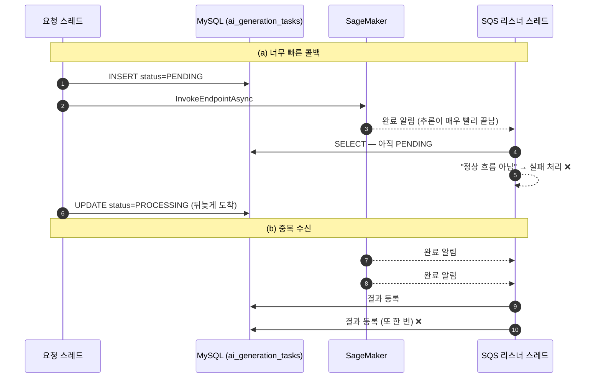

# 3. SQS 콜백 경합 조건 — 비관적 락과 재시도 유도

> 요약 · [README — 3. SQS 콜백 경합 조건](../../README.md#3-sqs-콜백-경합-조건--비관적-락과-재시도-유도)
> 근거 · [`AiNotificationSqsListener.java`](../../src/main/java/com/serverbe/infrastructure/config/event/AiNotificationSqsListener.java) · [`JpaAiTaskRepository.java`](../../src/main/java/com/serverbe/adapter/out/persistence/task/JpaAiTaskRepository.java) · [`AsyncRaceConditionException.java`](../../src/main/java/com/serverbe/domain/exception/server/AsyncRaceConditionException.java)
> 커밋 · `51cf87f`, `cae72bf`

## 1. 상황

AI 러닝 아트 생성은 요청과 완료가 **서로 다른 스레드, 서로 다른 시각**에 일어납니다.

1. 요청 스레드가 `PENDING` 상태로 작업을 저장하고, S3에 프롬프트를 올리고, SageMaker 비동기 추론을 호출합니다.
2. 호출이 성공하면 상태를 `PROCESSING`으로 갱신합니다.
3. SageMaker가 추론을 마치면 결과를 S3에 쓰고 SNS로 완료를 알리며, 그 알림이 SQS를 거쳐
   `AiNotificationSqsListener`에 도착합니다.

여기서 **2번과 3번 사이에는 아무런 순서 보장이 없습니다.** 둘은 같은 `ai_generation_tasks` 행을 건드리는
독립된 스레드입니다.

## 2. 증상

두 가지가 서로 반대 방향으로 나타났습니다.

**(a) 너무 빠른 콜백** — 추론이 매우 빨리 끝나면 완료 알림이 2번보다 먼저 도착합니다. 리스너는 아직
`PENDING`인 작업을 보고 "정상 흐름이 아니다"라고 판단해 실패 처리해 버립니다. 사용자에게는 **분명히 성공한
추론이 실패로 통보**됩니다. 추론이 빠를수록 잘 터지므로, 프롬프트가 단순한 요청일수록 더 자주 실패하는
납득하기 어려운 패턴이 됩니다.

**(b) 중복 수신** — SQS는 at-least-once입니다. 같은 메시지가 두 번 도착하면 결과 등록 파이프라인이 두 번
돌아 **러닝 아트가 두 벌 저장**됩니다.

## 3. 원인

요청 스레드와 리스너 스레드가 동일 레코드에 순서 보장 없이 접근하는 전형적인 경합 조건입니다.
아래 두 인터리빙이 각각 (a)와 (b)를 만듭니다.



## 4. 검토한 대안

| 대안 | 기각 이유 |
| --- | --- |
| 낙관적 락(`@Version`) | 충돌을 **감지만** 하고 예외로 끝납니다. 우리에게 필요한 것은 감지가 아니라 **직렬화**입니다. 리스너가 요청 스레드의 갱신을 기다렸다가 이어서 처리해야 하는데, 낙관적 락은 기다려 주지 않습니다. |
| 리스너에서 짧게 sleep 후 재조회 | 스레드를 붙잡고 자는 동안 SQS 컨슈머 슬롯이 낭비되고, "얼마나 자야 충분한가"에 대한 답이 없습니다. 요청 스레드가 5초 걸리는 날에는 그대로 실패합니다. |
| 요청 스레드가 `PROCESSING`을 먼저 저장한 뒤 SageMaker 호출 | 순서를 뒤집으면 (a)는 사라지지만, **호출이 실패했는데도 `PROCESSING`으로 남는 유령 작업**이 생깁니다. 상태가 거짓말을 하는 쪽이 더 나쁩니다. |
| Redis 분산 락으로 리스너 진입 직렬화 | 지켜야 할 대상이 DB 행 하나인데 정합성 경계를 Redis로 옮기게 됩니다. Redis가 죽으면 정합성이 함께 깨집니다. DB 행 락이면 이 문제가 없습니다. |
| SQS FIFO 큐 + 메시지 그룹으로 중복 제거 | 큐에 메시지를 넣는 주체가 우리가 아니라 **SageMaker**입니다. 큐 타입과 중복 제거 정책을 우리가 정할 수 없습니다. |

## 5. 해결

### 5-1. 비관적 락으로 직렬화

리스너 메서드를 `@Transactional`로 묶고, 조회 자체를 `SELECT ... FOR UPDATE`로 바꿨습니다.

```java
// JpaAiTaskRepository.java
@Lock(LockModeType.PESSIMISTIC_WRITE)
@Query("SELECT t FROM AiTaskEntity t WHERE t.id = :id")
Optional<AiTaskEntity> findByIdForUpdate(@Param("id") String id);
```

`@Transactional`이 없으면 락은 조회 직후 곧바로 풀립니다. 그래서 리스너의 애노테이션에는 주석이 붙어
있습니다 — `@Transactional // 비관적 락을 유지하기 위해 반드시 트랜잭션이 필요합니다!`

### 5-2. `PENDING`이면 예외를 던져 재시도를 유도

락을 잡아도 (a)는 남습니다. 요청 스레드가 아직 `PROCESSING`을 **저장조차 하지 않은** 상태라면,
리스너가 락을 먼저 잡고 `PENDING`을 보게 됩니다. 이때는 실패로 확정하지 않고 예외를 던집니다.

```java
// [경합 조건 방어] 메인 스레드가 아직 PROCESSING으로 상태를 업데이트하지 못했다면 재시도를 유도합니다.
if (task.isPending()) {
    throw new AsyncRaceConditionException(
            ServerErrorCode.ASYNC_RACE_CONDITION,
            String.format("Task [%s] 가 아직 PENDING 상태입니다. ...", task.id())
    );
}
```

예외를 던지면 트랜잭션이 롤백되고 SQS는 메시지를 삭제하지 않습니다. **가시성 타임아웃이 지나면 같은
메시지가 다시 배달**되고, 그사이 요청 스레드는 `PROCESSING` 저장을 끝냈을 것입니다. 별도의 재시도 코드도,
sleep도 필요 없습니다. **SQS가 이미 갖고 있는 재시도 메커니즘을 그대로 씁니다.**

이 예외만 `WARN`으로 로깅하는 것도 의도된 구분입니다. 이것은 장애가 아니라 **정상 시스템 흐름의 일부**이고,
`ERROR`로 남기면 진짜 장애가 로그에 묻힙니다.

```java
} catch (AsyncRaceConditionException e) {
    // PENDING 상태로 인한 재시도 유도 예외는 WARN 레벨로 로깅 (정상적인 시스템 흐름 중 하나)
    log.warn("[SQS Listener] 비동기 경합 조건(Race Condition) 발생 - {}", e.getMessage());
    throw e;
} catch (Exception e) {
    log.error("[SQS Listener] SQS 메시지 처리 중 오류 - TaskID: {}", taskId, e);
    throw e;
}
```

### 5-3. 종결 상태면 멱등하게 스킵 — 단, 자원은 정리

(b)의 해법입니다. 이미 `COMPLETED`/`FAILED`인 작업은 재처리하지 않습니다. 그런데 **그냥 `return`하면 안
됩니다.** 뒤늦게 도착한 알림이 가리키는 S3 결과물은 아무도 참조하지 않는 채 스토리지 비용으로 남습니다.

```java
// [멱등성 보장] 이미 종결된 작업은 절대 재처리하지 않고, 남아 있을 수 있는 임시 자원만 정리합니다.
if (!task.isProcessable()) {
    log.info("[SQS Listener] Task {} 는 이미 종결된 작업입니다(현재 상태: {}). ...", task.id(), task.status());
    cleanUpResourcesAfterCommit(task);
    return;
}
```

### 5-4. 정리는 반드시 커밋 이후에

`cleanUpResourcesAfterCommit`은 S3 삭제를 트랜잭션 밖으로 밀어냅니다. 이유가 두 가지입니다.

- **커넥션·락 점유** — S3 삭제는 네트워크 I/O입니다. 트랜잭션 안에서 하면 그동안 DB 커넥션과 **비관적 락을
  붙잡은 채** 외부 응답을 기다리게 됩니다. 락을 기다리는 다른 스레드가 함께 늘어집니다.
- **정합성** — 트랜잭션이 롤백되어 작업이 여전히 살아 있는데 파일만 먼저 지워지면 되돌릴 수 없습니다.

```java
private void cleanUpResourcesAfterCommit(AiTask task) {
    if (!TransactionSynchronizationManager.isSynchronizationActive()) {
        // 트랜잭션 없이 호출된 경우(테스트 등)에는 즉시 정리합니다.
        resourceCleaner.cleanUp(task);
        return;
    }
    TransactionSynchronizationManager.registerSynchronization(new TransactionSynchronization() {
        @Override
        public void afterCommit() {
            resourceCleaner.cleanUp(task);
        }
    });
}
```

트랜잭션이 없을 때 즉시 정리하는 분기는 **테스트를 위한 타협이 아니라 정확성 조건**입니다. 이 분기가 없으면
`afterCommit` 등록 자체가 예외를 던지거나 조용히 누락되어, 트랜잭션 없이 호출된 경로에서 자원이 영영
정리되지 않습니다.

### 5-5. Task ID는 `inferenceId`에서 먼저 찾는다

경합과는 별개지만 같은 리스너에서 함께 잡은 문제입니다. 초기 구현은 결과물 S3 경로를 파싱해 Task ID를
얻었습니다. 그런데 **실패 알림은 성공 알림과 페이로드 구조가 달라 결과물 경로가 아예 없습니다.**
경로 파싱에만 의존하면 추론 실패가 DB에 기록되지 못한 채 **전량 DLQ로 빠집니다.**

추론 요청 시 우리가 Task ID를 그대로 `inferenceId`에 넣어 보내고 SageMaker가 **성공·실패 알림 모두에**
되돌려주므로, 이쪽을 1순위로 두고 경로 파싱은 하위 호환 경로로 남겼습니다.

경로 파싱 쪽에도 함정이 있습니다. SageMaker 비동기 추론은 입력 파일명 뒤에 `.out` 같은 확장자를 임의로
덧붙입니다(`1234-abcd.json.out`). 그래서 **첫 번째 점 앞까지만** 잘라 UUID를 복원합니다.

### 5-6. 마지막 안전망은 DLQ

위 분기에 걸리지 않은 예외는 삼키지 않고 그대로 전파합니다. SQS 재시도가 모두 소진되면 메시지는
**DLQ로 이동**하고, 유실 대신 사후 조사 가능한 형태로 남습니다. 인프라 쪽 DLQ 정의는
[`infra/docs/architecture.md`](../../infra/docs/architecture.md)의 비동기 파이프라인 절에 있습니다.

## 6. 검증

- **단위 테스트** — [`AiNotificationSqsListenerTest.java`](../../src/test/java/com/serverbe/infrastructure/config/event/AiNotificationSqsListenerTest.java)
  가 `PENDING` 진입 시 `AsyncRaceConditionException`이 던져지는지, 종결 상태에서 결과 등록이
  호출되지 않고 자원 정리만 수행되는지를 검증합니다. (`./gradlew test`)
- **AWS 없이 전체 흐름 재현** — 로컬/개발 프로파일 전용 시뮬레이션 엔드포인트로 SQS를 거치지 않고
  리스너를 직접 호출할 수 있습니다.

  ```bash
  curl -X POST "http://localhost:8080/api/v1/test/ai/tasks/{taskId}/mock-sqs-receive?status=Completed"
  curl -X POST "http://localhost:8080/api/v1/test/ai/tasks/{taskId}/mock-sqs-receive?status=Failed"
  ```

  같은 taskId로 두 번 호출하면 두 번째 호출이 멱등 스킵 경로(`이미 종결된 작업입니다`)를 타는 것을
  로그로 확인할 수 있습니다. ([`AiTestController.java`](../../src/main/java/com/serverbe/adapter/in/web/AiTestController.java))
- **락 확인** — `JPA_SHOW_SQL=true`로 띄우면 조회 쿼리에 `for update`가 붙는 것이 로그에 보입니다.

## 7. 남은 과제

- 재시도가 반복되는 상황(요청 스레드가 오래 지연되는 경우)에서 같은 메시지가 몇 번까지 재배달되는지는
  큐의 `maxReceiveCount`에 달려 있습니다. 지금은 인프라 기본값을 쓰고 있으며, 실사용 지표를 보고
  `PENDING` 재시도가 DLQ를 오염시키지 않는 값인지 확인할 필요가 있습니다.
