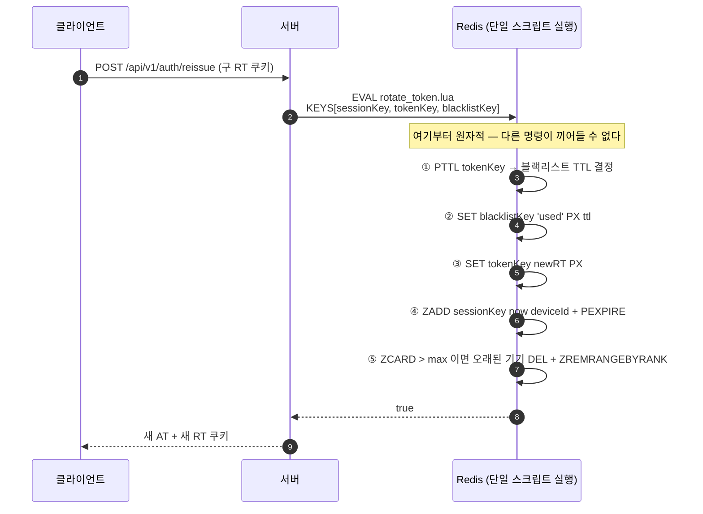

# 6. Refresh Token Rotation — Lua 원자적 회전과 기기별 세션 관리

> 요약 · [README — 6. Refresh Token Rotation](../../README.md#6-refresh-token-rotation--lua-원자적-회전과-기기별-세션-관리)
> 근거 · [`rotate_token.lua`](../../src/main/resources/scripts/rotate_token.lua) · [`save_token.lua`](../../src/main/resources/scripts/save_token.lua) · [`delete_token.lua`](../../src/main/resources/scripts/delete_token.lua) · [`global_logout.lua`](../../src/main/resources/scripts/global_logout.lua) · [`RefreshTokenSessionAdapter.java`](../../src/main/java/com/serverbe/adapter/out/persistence/token/RefreshTokenSessionAdapter.java)

## 1. 상황

Refresh Token Rotation은 재발급 때마다 토큰을 새로 발급하고 **구 토큰을 즉시 무효화**하는 방식입니다.
토큰이 탈취되어도 정상 사용자가 한 번 재발급하는 순간 탈취본이 죽습니다.

Redis에는 두 가지 구조로 저장합니다.

| 구조 | 키 | 용도 |
| --- | --- | --- |
| String | `auth:{userId}:rt:{deviceId}` | 기기별 리프레시 토큰. **기기마다 독립 TTL** |
| ZSet | `auth:sessions:{userId}` | 로그인 시각 기준 정렬된 기기 인덱스. 최대 기기 수 관리 |

기기별로 String 키를 나눈 이유는 **TTL이 기기마다 달라야 하기 때문**입니다. 해시 하나에 모아 두면
필드별 TTL을 줄 수 없어, 한 기기의 만료가 다른 기기에 영향을 줍니다.

## 2. 증상 — 재발급은 네 개 연산이다

재발급 한 번에 필요한 일이 넷입니다.

1. 구 토큰을 블랙리스트에 등록
2. 신 토큰 저장
3. 세션 인덱스(ZSet) 갱신
4. 최대 기기 수 초과분 제거

**이 넷은 전부 성공하거나 전부 실패해야 합니다.** 애플리케이션에서 순차 호출하면 중간에 프로세스가 죽거나
Redis 연결이 끊길 때 어중간한 상태가 남고, 그 상태가 전부 보안 사고입니다.

| 어디서 끊기나 | 남는 상태 | 결과 |
| --- | --- | --- |
| 1 다음 | 구 토큰만 블랙리스트, 신 토큰 없음 | 사용자가 **로그아웃됨** (양쪽 토큰 모두 무효) |
| 2 다음 | 신 토큰은 있는데 구 토큰이 살아 있음 | **탈취된 구 토큰이 계속 유효** |
| 3 다음 | 세션 인덱스가 실제 토큰과 어긋남 | 기기 수 제한이 오작동, 유령 세션이 목록에 남음 |

## 3. 원인

Redis 명령 각각은 원자적이지만 **네 명령의 묶음은 원자적이지 않습니다.** 그리고 이 묶음은 서로 다른
Redis 자료구조(String 2개 + ZSet)를 건드리므로 단일 명령으로 표현할 수도 없습니다.

## 4. 검토한 대안

| 대안 | 기각 이유 |
| --- | --- |
| `MULTI`/`EXEC` 트랜잭션 | Redis 트랜잭션은 **중간 결과를 읽어 분기할 수 없습니다.** 우리는 구 토큰의 `PTTL`을 읽어 블랙리스트 TTL로 쓰고, `ZCARD` 결과에 따라 축출 여부를 정합니다. `MULTI` 안에서는 응답이 `EXEC` 시점에야 오므로 불가능합니다. |
| `WATCH` + 재시도 | 재시도 루프가 필요하고, 재발급이 몰릴수록 충돌이 늘어납니다. 로직도 복잡해집니다. |
| DB에 리프레시 토큰 저장 후 트랜잭션 | 매 재발급마다 DB 쓰기가 발생합니다. 토큰 검증은 요청마다 일어나는 고빈도 경로라 Redis가 맞습니다. |
| 실패 시 보상 로직으로 되돌린다 | 보상 코드 자체가 실패할 수 있고, 그 실패를 또 처리해야 합니다. 애초에 나뉘지 않게 만드는 편이 짧습니다. |
| 구 토큰을 그냥 `DEL` | 블랙리스트가 없으면 **이미 발급된 액세스 토큰**을 무효화할 수단이 사라집니다. 또 "지워졌다"와 "탈취되어 회전당했다"를 구분할 수 없습니다. |

## 5. 해결

### 5-1. 네 연산을 하나의 Lua 스크립트로



### 5-2. 블랙리스트 TTL은 구 토큰의 **잔여** 수명

```lua
-- 1. 기존 토큰의 남은 수명(PTTL) 조회
local existingTtl = redis.call('PTTL', KEYS[2])
local blacklistTtl = ARGV[8]

-- PTTL이 유효한 경우(0보다 큼) 그 시간을 사용
if existingTtl > 0 then
    blacklistTtl = existingTtl
end
```

구 토큰은 **원래 만료 시각이 지나면 어차피 무효**입니다. 그 뒤로도 블랙리스트에 남겨 둘 이유가 없습니다.
고정 TTL(예: 60일)로 잡으면 회전할 때마다 죽은 키가 60일씩 쌓여 Redis 메모리를 갉아먹습니다.

`ARGV[8]`(5분)은 `PTTL` 조회가 실패했을 때(키가 이미 없거나 TTL이 없는 경우)의 대체값입니다.
값을 못 읽었다고 블랙리스트를 건너뛰면 그 순간이 보안 구멍이 되므로, **짧게라도 반드시 등록**합니다.

### 5-3. 기기 수 제한 — ZSet 최고령 축출

```lua
local count = redis.call('ZCARD', KEYS[1])
local max = tonumber(ARGV[6])

if count > max then
    local removeCount = count - max
    local oldestDevices = redis.call('ZRANGE', KEYS[1], 0, removeCount - 1)
    for _, oldDeviceId in ipairs(oldestDevices) do
        redis.call('DEL', ARGV[7] .. oldDeviceId)   -- 토큰 키 자체를 삭제
    end
    redis.call('ZREMRANGEBYRANK', KEYS[1], 0, removeCount - 1)
end
```

ZSet의 score를 로그인 시각으로 두었으므로 `ZRANGE 0 N`이 곧 **가장 오래된 기기**입니다.
`removeCount`를 `count - max`로 계산해 **여러 개가 한꺼번에 초과된 경우도** 처리합니다.

축출 시 ZSet에서 지우는 것만으로는 부족합니다. **실제 토큰 키를 `DEL` 하지 않으면 인덱스에서만
사라지고 토큰은 계속 유효**합니다. 그래서 인덱스 정리(`ZREMRANGEBYRANK`)와 키 삭제(`DEL`)를 함께 합니다.

### 5-4. 네 개 스크립트의 역할 분담

| 스크립트 | KEYS | 하는 일 |
| --- | --- | --- |
| `save_token.lua` | sessionKey, tokenKey | 최초 로그인. 토큰 저장 → 세션 인덱스 등록 → 초과 기기 축출 |
| `rotate_token.lua` | sessionKey, tokenKey, blacklistKey | 재발급. 위 4단계 |
| `delete_token.lua` | sessionKey, tokenKey | 단일 기기 로그아웃. `DEL` + `ZREM` |
| `global_logout.lua` | sessionKey | 전역 로그아웃. `ZRANGE`로 전 기기를 훑어 각 토큰 키를 지우고 인덱스까지 제거 |

`global_logout.lua`가 별도로 필요한 이유는, 기기 목록을 애플리케이션이 먼저 조회한 뒤 하나씩 지우면
**조회와 삭제 사이에 새 기기가 로그인**할 수 있기 때문입니다. 그 기기는 전역 로그아웃을 피해 갑니다.

### 5-5. 토큰은 해시로만 저장

토큰 원문을 Redis 키에 쓰지 않고 **SHA-256 해시**를 씁니다. Redis 덤프나 `KEYS` 결과가 유출되어도
토큰 자체를 얻지 못합니다. 로그도 마찬가지입니다.

```java
log.warn("[SECURITY AUDIT] Redis 장애로 블랙리스트 검증 우회. Token Hash: {}, Reason: {}",
        DigestUtils.sha256Hex(accessToken), e.getMessage());
```

`hashCode()`가 아니라 `sha256Hex`인 것도 의도적입니다. `hashCode()`는 충돌이 흔해 감사 추적에 쓸 수 없고,
값이 짧아 역추적 가능성도 있습니다.

### 5-6. 블랙리스트 검증의 Fail-Open과 감사 로그

```java
} catch (RedisConnectionFailureException | QueryTimeoutException e) {
    log.warn("[SECURITY AUDIT] Redis 장애로 블랙리스트 검증 우회. ...");
    return false;   // 블랙리스트가 아니라고 간주 → 요청 통과
}
```

Redis가 죽었을 때 **모든 인증을 실패시키면 전면 장애**가 됩니다. 그래서 통과시킵니다.
다만 이것은 **"블랙리스트에 오른 토큰이 잠시 살아난다"는 위험을 감수한 결정**이므로,
`[SECURITY AUDIT]` 태그를 붙여 사후에 반드시 추적할 수 있게 남깁니다.

예외를 `Exception`이 아니라 `RedisConnectionFailureException | QueryTimeoutException`으로 좁힌 것도
중요합니다. 넓게 잡으면 **코드 버그로 인한 예외까지 조용히 통과**됩니다. 그 아래 `DataAccessException`
분기는 `ERROR`로 남겨 구분합니다.

## 6. 검증

- **원자성 확인** — Redis MONITOR로 재발급 한 번에 나가는 명령을 관찰합니다. Lua는 `EVALSHA` 한 줄로
  나타나며, 내부 명령이 다른 클라이언트 명령과 섞이지 않습니다.

  ```bash
  docker compose exec redis redis-cli MONITOR
  curl -i -X POST http://localhost:8080/api/v1/auth/reissue -b "refreshToken=<구 토큰>"
  ```
- **블랙리스트 TTL 확인** — 회전 직후 블랙리스트 키의 TTL이 **구 토큰의 잔여 수명과 비슷한지** 봅니다.
  60일 같은 값이 나오면 `PTTL` 경로가 아니라 대체값 경로를 탄 것입니다.

  ```bash
  docker compose exec redis redis-cli --scan --pattern 'BL:RT*'
  docker compose exec redis redis-cli PTTL "<블랙리스트 키>"
  ```
- **기기 수 제한** — `redis.auth.max-token`(기본 3)을 넘겨 로그인한 뒤 ZSet 크기와 토큰 키 수가 모두
  한도 이내인지 확인합니다. **둘 중 하나만 줄었다면 축출 로직이 반쪽입니다.**

  ```bash
  docker compose exec redis redis-cli ZRANGE "auth:sessions:1" 0 -1 WITHSCORES
  docker compose exec redis redis-cli --scan --pattern 'auth:1:rt:*'
  ```
- **구 토큰 무효화** — 회전 후 구 토큰으로 다시 재발급을 시도하면 거부되어야 합니다.
- **블랙리스트 성능** — [`BlacklistPerformanceTest.java`](../../src/test/java/com/serverbe/BlacklistPerformanceTest.java)
  (`./gradlew integrationTest --tests "com.serverbe.BlacklistPerformanceTest"`)

## 7. 남은 과제

- 블랙리스트 Fail-Open 구간에 대한 **알림이 없습니다.** `[SECURITY AUDIT]` 로그는 남지만 사람이
  CloudWatch를 봐야 압니다. 보안 관련 우회는 서킷 브레이커 알림처럼 Discord로 흘리는 편이 낫습니다.
- 로그아웃되지 않은 기기의 세션 인덱스는 ZSet TTL(`PEXPIRE`)에 의존합니다. 사용자가 오래 재로그인하지
  않으면 인덱스가 먼저 만료되고 토큰 키만 남는 구간이 이론적으로 존재합니다. 실사용상 문제는 없었지만
  두 TTL의 관계를 명시적으로 문서화해 둘 필요가 있습니다.
