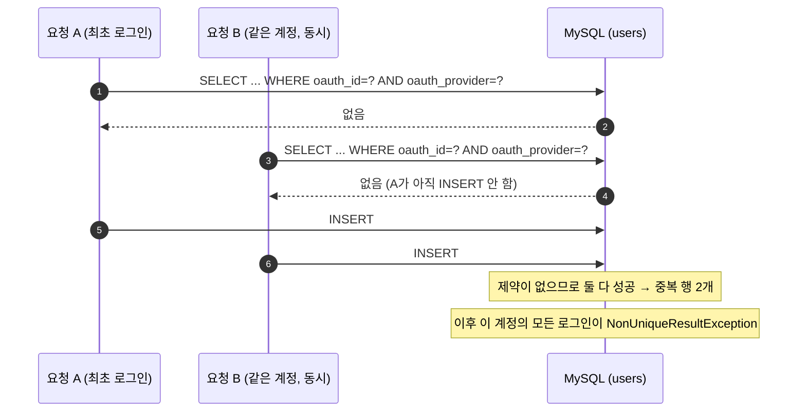

# 7. 소셜 계정 중복 가입 — 선언만 있고 실재하지 않던 유니크 제약

> 요약 · [README — 7. 소셜 계정 중복 가입](../../README.md#7-소셜-계정-중복-가입--선언만-있고-실재하지-않던-유니크-제약)
> 근거 · [`UserEntity.java`](../../src/main/java/com/serverbe/adapter/out/persistence/user/UserEntity.java) · [`UserDataSyncManager.java`](../../src/main/java/com/serverbe/application/service/helper/UserDataSyncManager.java) · [`V3__add_users_oauth_unique.sql`](../../src/main/resources/db/migration/V3__add_users_oauth_unique.sql)

## 1. 상황

소셜 로그인은 "이 `(oauth_id, provider)` 조합의 사용자가 있으면 갱신하고, 없으면 새로 만든다"는
전형적인 upsert입니다. 엔티티는 처음부터 유니크 제약을 **선언하고 있었습니다.**

## 2. 증상

**어느 날부터 특정 계정만 로그인이 되지 않고, 재시도로도 절대 복구되지 않았습니다.**

```
NonUniqueResultException: Query did not return a unique result: 2 results were returned
```

`findByOauthIdAndProvider`가 `Optional<User>`를 반환하는데 행이 두 개면 예외입니다. 그리고 이 상태는
**스스로 낫지 않습니다.** 중복 행이 남아 있는 한 그 계정의 모든 로그인이 영구히 실패합니다.
사용자 입장에서는 "잘 쓰던 서비스가 갑자기 로그인 불가"이고, 앱을 지웠다 깔아도 소용이 없습니다.

## 3. 원인

### 3-1. 제약이 실제로 만들어진 적이 없다

```java
@Table(name = "users", uniqueConstraints = {
        // columnNames 는 자바 필드명이 아니라 물리 컬럼명을 받습니다. 여기에 필드명 "provider" 를 적으면
        // 어떤 컬럼도 가리키지 못해 제약이 만들어지지 않고, ddl-auto: validate 는 유니크 인덱스를 검증하지
        // 않으므로 기동 시점에도 드러나지 않습니다. 실제 인덱스는 V3 마이그레이션이 같은 이름으로 생성합니다.
        @UniqueConstraint(name = "uk_users_oauth", columnNames = {"oauth_id", "oauth_provider"})
})
```

원인은 두 겹입니다.

- **`columnNames`는 물리 컬럼명을 받습니다.** 자바 필드명은 `provider`인데 컬럼은
  `@Column(name = "oauth_provider")`였습니다. 존재하지 않는 컬럼을 가리킨 제약은 **조용히 무시**됩니다.
  오타도 아니고 컴파일 에러도 아닙니다.
- **`ddl-auto: validate`는 유니크 인덱스를 보지 않습니다.** 테이블·컬럼·타입만 검증합니다.
  그래서 기동 시점에도 드러나지 않았습니다.

즉 **"선언은 있는데 DB에는 없는"** 상태가 오래 유지됐습니다. 코드를 읽는 사람은 제약이 있다고 믿습니다.

### 3-2. 애플리케이션 방어는 원래 아무것도 보장하지 못한다

그동안 중복을 막아 온 것은 "조회 후 없으면 삽입" 로직뿐이었습니다. 이 패턴은 **두 요청이 동시에 조회
단계를 통과**할 수 있습니다.



애플리케이션 코드는 중복을 **줄일** 뿐 **거부하지 못합니다.** 거부는 DB만 할 수 있습니다.

## 4. 검토한 대안

| 대안 | 기각 이유 |
| --- | --- |
| 조회~삽입 구간을 애플리케이션 락으로 감싼다 | 인스턴스가 여러 대면 JVM 락은 무의미합니다. Redis 분산 락으로 올려도 **락이 죽으면 정합성이 함께 죽습니다.** 정합성의 최종 근거는 DB 제약이어야 합니다. |
| `INSERT ... ON DUPLICATE KEY UPDATE` | 유니크 인덱스가 있어야 동작합니다. 결국 인덱스를 먼저 만들어야 하고, 그 인덱스가 있으면 지금 방식으로 충분합니다. JPA 경로를 우회하게 되는 비용도 있습니다. |
| `SELECT ... FOR UPDATE`로 조회 직렬화 | **없는 행에는 락을 걸 수 없습니다.** 최초 가입 경합이 정확히 "행이 아직 없는" 상황이라 갭 락 동작에 의존하게 되고, 격리 수준에 따라 결과가 달라집니다. |
| 중복 행을 그냥 지운다 (제약 없이) | 다시 생깁니다. 원인은 제약의 부재입니다. |
| `findFirst...`로 바꿔 예외만 회피 | 로그인은 되지만 **어느 계정이 진짜인지 모르는 채** 러닝 아트가 둘로 갈립니다. 증상만 숨기고 데이터 파손을 키웁니다. |
| `ddl-auto: update`로 제약을 만들게 한다 | Hibernate의 `update`는 기존 테이블에 유니크 제약을 붙여준다는 보장이 없고, **중복 행이 있으면 어차피 실패**합니다. 정리 순서를 표현할 수 없습니다. |

## 5. 해결

### 5-1. 선언 교정 — 이름을 못 박는다

컬럼명을 `oauth_provider`로 고치고 제약에 **이름(`uk_users_oauth`)을 명시**했습니다. 마이그레이션이
만드는 인덱스도 같은 이름을 씁니다. 이름이 일치해야 이후 마이그레이션이 대상을 특정할 수 있습니다.
(이름 불일치가 실제로 문제를 일으킨 사례는 [9. 스키마 드리프트](09-schema-drift-flyway-hibernate.md)에 있습니다.)

### 5-2. 기존 중복 정리 — 순서가 전부다

`V3` 마이그레이션은 5단계이고, **각 단계의 순서에 이유가 있습니다.**

| 단계 | 하는 일 | 왜 이 순서인가 |
| --- | --- | --- |
| 1 | `tmp_user_dedup(dup_id, keep_id)` 물질화 | MySQL은 UPDATE/DELETE 대상 테이블을 서브쿼리에서 직접 참조할 수 없습니다. 매핑을 임시 테이블로 먼저 뽑아야 합니다. 유지 계정은 `MIN(id)` — **최초 가입 계정**입니다. |
| 2 | 잃는 계정의 진행 중 작업을 `FAILED`로 종결 + `active_user_id = NULL` | **여기가 핵심입니다.** V2가 만든 `uk_ai_task_active_user`(active_user_id 유니크) 때문에, 두 계정이 각각 진행 중 작업을 갖고 있으면 3단계에서 `user_id`만 옮기는 순간 슬롯이 겹쳐 **이관 자체가 실패**합니다. |
| 3 | `running_arts` → `ai_generation_tasks` 순으로 이관 | `running_arts`를 먼저 옮기지 않으면 4단계 DELETE가 `fk_running_arts_user` 외래키에 걸립니다. |
| 4 | 중복 `users` 행 삭제 + 임시 테이블 정리 | |
| 5 | `CREATE UNIQUE INDEX uk_users_oauth` | 데이터가 깨끗해진 뒤에야 제약을 걸 수 있습니다. 순서를 바꾸면 인덱스 생성이 실패합니다. |

```sql
-- 2) 잃는 계정이 점유 중이던 작업 슬롯을 먼저 반납
UPDATE ai_generation_tasks t
    JOIN tmp_user_dedup d ON t.user_id = d.dup_id
SET t.status         = 'FAILED',
    t.active_user_id = NULL,
    t.error_message  = '중복 계정 통합에 따른 진행 작업 종결 (V3 마이그레이션)',
    t.updated_at     = NOW(6)
WHERE t.status IN ('PENDING', 'PROCESSING');
```

행을 지우지 않고 **이관**을 택한 것도 판단입니다. 중복 계정에도 사용자가 만든 러닝 아트가 있을 수 있고,
그것을 지우는 것은 되돌릴 수 없습니다.

### 5-3. 경합에서 진 요청을 살려 보내기 — `REQUIRES_NEW`

제약이 생기면 경합에서 진 쪽은 `DataIntegrityViolationException`을 받습니다. 그대로 두면 사용자에게
500이 갑니다. 하지만 **그 시점에는 이긴 쪽의 행이 이미 커밋되어 있으므로**, 다시 조회하면 반드시 찾습니다.

문제는 **재조회를 할 수 있느냐**입니다.

```java
/**
 * 바깥 트랜잭션에 합류시키면 uk_users_oauth 위반 시 그 트랜잭션까지 rollback-only 로
 * 오염되어 뒤이은 재조회 자체가 불가능해집니다. REQUIRES_NEW 로 분리해 두면
 * 실패가 안쪽 트랜잭션에만 갇히고 바깥은 그대로 살아남아 복구 조회를 수행할 수 있습니다.
 */
private final TransactionTemplate registrationTransactionTemplate;
```

```java
this.registrationTransactionTemplate = new TransactionTemplate(transactionManager);
this.registrationTransactionTemplate.setPropagationBehavior(TransactionDefinition.PROPAGATION_REQUIRES_NEW);
```

`syncUserByOAuth`는 `@Transactional`이므로 바깥 트랜잭션이 있습니다. INSERT를 그 안에서 하면 제약 위반이
**바깥 트랜잭션을 rollback-only로 오염**시키고, 그 뒤의 `findByOauthId`는
`UnexpectedRollbackException`으로 끝납니다. 복구 로직을 아무리 잘 짜도 실행될 수 없습니다.

`REQUIRES_NEW`로 INSERT만 별도 트랜잭션에 가두면, 실패가 안쪽에 갇히고 바깥은 멀쩡히 살아남습니다.

```java
} catch (DataIntegrityViolationException e) {
    log.warn("[REGISTER] 동시 최초 로그인 경합 감지, 기존 회원으로 복구합니다: Provider={}", oauthInfo.provider());

    return userRepositoryPort.findByOauthId(oauthInfo.oauthId(), oauthInfo.provider())
            .map(existingUser -> refresh(existingUser, oauthInfo))
            .orElseThrow(() -> e);
}
```

`.orElseThrow(() -> e)`도 의도적입니다. 재조회에도 없다면 그것은 경합이 아니라 **다른 제약 위반**이라는
뜻이므로, 원본 예외를 그대로 던져 진짜 문제를 숨기지 않습니다.

## 6. 검증

- **단위 테스트** — [`UserDataSyncManagerTest.java`](../../src/test/java/com/serverbe/application/service/helper/UserDataSyncManagerTest.java)
  가 `DataIntegrityViolationException` 이후 복구 조회로 정상 로그인이 완성되는지 검증합니다.
- **인덱스 존재 확인** — 이것이 이 항목의 핵심입니다. 선언이 아니라 **실물**을 봐야 합니다.

  ```bash
  docker compose exec mysql mysql -uroot -pletmein webflux \
    -e "SHOW INDEX FROM users WHERE Key_name = 'uk_users_oauth';"
  ```
- **중복 잔존 확인**

  ```bash
  docker compose exec mysql mysql -uroot -pletmein webflux \
    -e "SELECT oauth_id, oauth_provider, COUNT(*) c FROM users
        GROUP BY oauth_id, oauth_provider HAVING c > 1;"
  ```
- **제약 동작 확인** — 같은 `(oauth_id, oauth_provider)`로 직접 INSERT를 두 번 시도하면 두 번째가
  `Duplicate entry`로 거부되어야 합니다.
- **마이그레이션 적용 확인**

  ```bash
  docker compose exec mysql mysql -uroot -pletmein webflux \
    -e "SELECT version, description, success FROM flyway_schema_history ORDER BY installed_rank;"
  ```

## 7. 남은 과제

- `ddl-auto: validate`가 유니크 인덱스를 검증하지 않는다는 사실은 이 항목의 근본 원인이었지만,
  **다른 제약에도 같은 사각지대가 남아 있습니다.** 스키마 실물과 엔티티 선언을 대조하는 검사를
  통합 테스트에 넣으면 같은 유형의 사고를 미리 잡을 수 있습니다.
- 이 사고는 "선언했으니 있겠지"라는 가정에서 왔습니다. 새 제약을 추가할 때는 **마이그레이션으로 만들고
  엔티티는 그 이름을 따라 적는** 방향을 기본값으로 삼는 편이 안전합니다.
