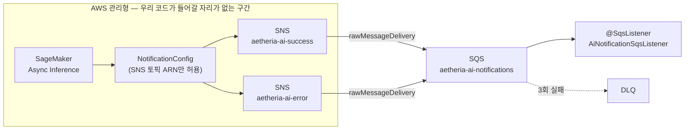
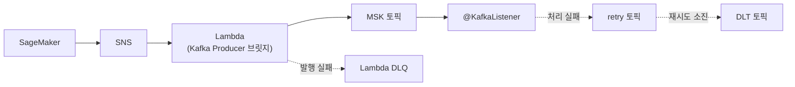

# 12. 메시지 브로커 선택 — 왜 SQS를 유지하고 Kafka로 가지 않았나

> 요약 · [README — 메시지 브로커 선택](../../README.md#메시지-브로커-선택--왜-sqs를-유지하고-kafka로-가지-않았나)

1~10번과 달리 이 문서는 **겪은 장애가 아니라 내리지 않은 결정**의 기록입니다.
"메시지 큐를 쓰는데 왜 Kafka가 아닌가"는 정당한 질문이고, 이 저장소에는 그 답이
CDK 주석에만 흩어져 있었습니다. 여기에 모아 둡니다.

---

## 1. 상황 — 질문의 전제부터 확인해야 한다

일반적인 비교는 "SQS는 큐, Kafka는 로그"에서 출발합니다. 순서 보장, 재처리, 팬아웃, 처리량을
축으로 놓고 우리 워크로드가 어느 쪽에 가까운지 따집니다.

그런데 이 시스템에서는 그 비교표를 펴기 전에 확인할 것이 하나 있습니다.
**이 서버는 SQS에 메시지를 넣은 적이 없습니다.**

`SqsTemplate`도, `SqsAsyncClient`도, `sendMessage` 호출도 코드에 존재하지 않습니다.
있는 것은 리스너 하나뿐이고, 그것은 빠뜨린 것이 아니라 인프라 수준에서 못 박은 제약입니다.

```ts
this.aiBucket.grantReadWrite(this.taskRole);
// 큐에 메시지를 넣는 주체는 SageMaker(→SNS)다. 백엔드는 소비만 하므로 SendMessage 는 주지 않는다.
// grantConsumeMessages 에 sqs:GetQueueUrl 이 포함되어 있어, 이름으로 큐를 찾는 @SqsListener 가 동작한다.
this.notificationQueue.grantConsumeMessages(this.taskRole);
this.deadLetterQueue.grantConsumeMessages(this.taskRole);
```

> [`infra/lib/app-stack.ts`](../../infra/lib/app-stack.ts)

즉 우리가 한 일은 **큐를 고른 것이 아니라 콜백을 받은 것**입니다.
이 차이가 아래의 모든 판단을 좌우합니다.

---

## 2. 발행자가 배달할 수 있는 곳이 SQS였다

SageMaker 비동기 추론은 결과를 알리기 위해 `NotificationConfig`를 받는데, 이 필드는
**SNS 토픽 ARN만** 받습니다. SQS를 직접 지정할 수 없습니다. 그래서 성공·실패 토픽 두 개를 만들고
그 토픽이 알림 큐를 구독하게 했습니다.



여기서 Kafka로 바꾼다는 것은 **우리 큐 구현을 교체하는 일이 아닙니다.** SNS가 배달할 수 있는
대상은 `http` · `https` · `email` · `email-json` · `sms` · `sqs` · `application` · `lambda` ·
`firehose` 아홉 가지이고, **이 목록에 Kafka는 없습니다.** Kinesis Data Streams도 없습니다.

그러므로 전환의 실체는 이렇습니다.



**관리형 이벤트 소스와 우리 컨슈머 사이에, 우리가 운영하는 브로커와 우리가 짠 브릿지를 끼워 넣는
일**입니다. 그리고 다이어그램 아래쪽이 말해 주듯 **실패 경로가 두 벌**로 늘어납니다 —
브릿지가 브로커에 넣지 못했을 때와, 컨슈머가 처리하지 못했을 때. 지금은 큐 하나에 붙은
`maxReceiveCount: 3`과 DLQ 하나가 그 둘을 함께 덮습니다.

---

## 3. 그래도 Kafka가 이기는 축

기울어진 비교가 되지 않도록, Kafka가 실제로 우위인 지점을 먼저 적습니다.

### 3-1. 오프셋 되감기 — 유일한 실질 이점, 그런데 여기서는 무효다

컨슈머 로직에 버그가 있어 100건을 잘못 처리했다면 SQS에는 되돌릴 방법이 없습니다.
ack된 메시지는 사라졌고, retention 4일은 **아직 삭제되지 않은 메시지**에만 적용됩니다.
Kafka라면 컨슈머 그룹 오프셋을 되감아 그대로 재처리할 수 있습니다.

이것이 이 프로젝트에서 Kafka의 **유일한 실질 이점**입니다. 그런데 여기서는 반쯤 무효입니다.

메시지가 실어 나르는 것은 결과물이 아니라 결과물의 **주소**(`outputLocation`)이고,
그 주소가 가리키는 S3 객체는 처리 직후 지워집니다.

```java
public void cleanUp(AiTask task) {
    if (task == null) {
        return;
    }

    for (String uri : task.s3ResourceUris()) {
        deleteQuietly(task.id(), uri);
    }
}
```

> [`AiTaskResourceCleaner.java`](../../src/main/java/com/serverbe/application/service/helper/AiTaskResourceCleaner.java)

정리를 놓치더라도 버킷 라이프사이클(`expire-processed-requests`)이 30일 뒤 만료시킵니다.
**메시지를 되감아도 그 메시지가 가리키는 원본이 없습니다.** 재처리는 객체 없음으로 끝납니다.

여기서 이 문서의 첫 번째 결론이 나옵니다.
**replay 가능 여부를 결정하는 것은 브로커가 아니라 원본 데이터의 보존 정책입니다.**
브로커를 Kafka로 바꿔도 S3를 지우는 한 되감기는 이름뿐이고, 반대로 S3를 보존한다면 SQS 위에서도
`taskId` 목록으로 재처리 배치를 돌릴 수 있습니다. 브로커는 이 능력의 필요조건이지 충분조건이 아닙니다.

### 3-2. 팬아웃 — 이미 SNS가 하고 있다

Kafka의 컨슈머 그룹은 같은 로그를 여러 소비자가 각자의 오프셋으로 읽게 해 줍니다.
그런데 **이 아키텍처에는 이미 SNS가 앞단에 있습니다.** 소비자를 하나 더 붙이는 일은 토픽에 큐를
하나 더 구독시키는 것으로 끝납니다. Kafka가 풀어 주는 문제가 여기서는 이미 풀려 있습니다.

(SNS 팬아웃이 못 하는 것이 정확히 하나 있고, 그것이 §5의 전환 트리거가 됩니다.)

### 3-3. 순서 보장 — 쓸 자리가 없다

Kafka는 파티션 키 단위로 순서를 보장합니다. 이 워크로드에는 메시지 간 순서 의존이 없습니다.
알림은 `inferenceId`(= 우리 taskId) 하나에 대한 단건이고, 같은 태스크에 성공·실패가 겹쳐 도착해도
상태 머신이 흡수합니다(`AiTask#isProcessable`, [3번 문서](03-sqs-callback-race-condition.md)).

**표준 큐를 쓰고 FIFO 큐조차 고르지 않은 이유와 같은 이유입니다.** 순서가 필요 없는 워크로드에
순서 보장을 사면 처리량 제약만 함께 삽니다.

### 3-4. 처리량당 비용 — 손익분기가 아득히 멀다

대규모에서는 SQS의 요청당 과금이 브로커 상시 비용을 넘어섭니다. 그 분기점을 계산해 봅니다.

- **SQS 측** — 롱폴링(20초)을 쓰는 컨슈머 1대는 유휴 상태에서 시간당 180회, 월 약 13만 회를
  호출합니다. 월 100만 건 프리티어 안입니다. 실제 메시지는 AI 태스크 1건당 콜백 1건입니다.
- **MSK 측** — Serverless는 클러스터 시간당 $0.75(us-east-1 기준)이므로 **메시지가 0건이어도
  월 $540 선**입니다. 여기에 파티션 시간당 요금과 데이터 전송·스토리지가 붙습니다.

SQS 요청 과금이 그 금액에 도달하려면 **월 10억 건 단위**가 필요합니다. 현재 인프라 전체가
[월 $115~125](../../infra/README.md)인 프로젝트에서, 브로커 하나가 그 총액의 네 배를 차지하는
구조를 감당할 근거가 없습니다.

---

## 4. Kafka로 바꿀 때 잃는 것

### 4-1. 가시성 타임아웃이 곧 재시도 스케줄러였다

이것이 두 번째 결론이자 결정타입니다.

[3번 문서](03-sqs-callback-race-condition.md)의 핵심 설계는 **아무것도 저장하지 않고 예외를 던지는
것**입니다. 추론이 너무 빨리 끝나 콜백이 `PROCESSING` 저장보다 먼저 도착하면, 알림 처리 쪽은 실패로
확정하지 않고 예외를 던져 ack를 막습니다.

```java
// [경합 조건 방어] 메인 스레드가 아직 PROCESSING으로 상태를 업데이트하지 못했다면 재시도를 유도합니다.
if (task.isPending()) {
    throw new AsyncRaceConditionException(
            ServerErrorCode.ASYNC_RACE_CONDITION,
            String.format("Task [%s] 가 아직 PENDING 상태입니다. ...", task.id())
    );
}
```

> [`AiNotificationService.java`](../../src/main/java/com/serverbe/application/service/AiNotificationService.java)

이 코드가 동작하는 이유는 자바에 있지 않고 **큐 설정에** 있습니다.

```ts
this.notificationQueue = new sqs.Queue(this, 'RequestQueue', {
  queueName: 'aetheria-ai-notifications',
  // 리스너가 아직 PENDING 인 태스크를 만나면 일부러 예외를 던져 가시성 타임아웃 뒤 재시도를 유도한다.
  // 이 값이 너무 짧으면 재시도가 몰리고, 실제 처리 시간보다 짧으면 같은 메시지가 중복 처리된다.
  visibilityTimeout: cdk.Duration.minutes(5),
  retentionPeriod: cdk.Duration.days(4),
  enforceSSL: true,
  deadLetterQueue: {
    queue: this.deadLetterQueue,
    maxReceiveCount: 3,
  },
});
```

던진 예외는 "5분 뒤에 다시 불러 달라"는 뜻입니다. **지연 재시도 스케줄러를 큐가 대신 갖고 있는
셈**이고, 그래서 우리 코드에는 재시도 상태도, 백오프 계산도, 스케줄러도 없습니다.

Kafka에는 이 계약이 없습니다. 컨슈머에서 예외를 던지면 오프셋이 커밋되지 않아 같은 레코드를
**즉시** 다시 읽고, 원인이 그대로면 그 파티션이 그 자리에서 멈춥니다. 5분 지연 재시도를 원하면
`retry-5m` 토픽과 그것을 지연 소비하는 별도 컨슈머를 만들어야 합니다.

**포팅 대상이 코드가 아니라 의미라는 것이 요점입니다.** `@SqsListener`를 `@KafkaListener`로
바꾸는 일은 기계적이지만, "예외를 던지면 5분 뒤 다시 온다"는 전제는 함께 옮겨지지 않습니다.

### 4-2. 느린 한 건이 뒤를 막는다

SQS는 가시성이 **메시지 단위**라, 오래 걸리는 한 건이 다른 메시지를 막지 않습니다.
Kafka는 오프셋이 **파티션 단위**라 앞 레코드가 막히면 뒤가 전부 밀립니다(head-of-line blocking).

이 리스너의 처리는 짧지 않습니다. S3 결과물 다운로드, DB 쓰기, 그리고 `RunningArtRegistrationService`가
리스너 스레드에서 수행하는 블로킹 WebClient 호출까지 포함해 건당 수 초입니다.
파티션 수를 늘려 완화할 수 있지만, 그것은 **지금은 존재하지 않는 튜닝 축**을 새로 떠안는 일입니다.

### 4-3. DLQ와 로컬 개발 표면

- DLQ는 지금 CDK 한 줄(`maxReceiveCount: 3`)입니다. Kafka에서는 재시도 토픽과 DLT를 직접 설계합니다.
- MSK 브로커는 VPC 서브넷을 차지하고 AZ당 하나가 권장입니다. 지금 VPC는 NAT 1개,
  인터페이스 엔드포인트 기본 off([`config.ts`](../../infra/lib/config.ts)의 `enableInterfaceEndpoints`)라는
  **비용 최소화 기조** 위에 서 있습니다.
- [10번 문서](10-sqs-listener-startup-failure.md)에서 `AWS_SQS_ENABLED=false` 한 줄로 폴링만 껐던
  자리에, Kafka는 `docker-compose.yml`에 브로커를 추가하거나 Testcontainers를 도입해야 합니다.
  현재 compose가 띄우는 인프라는 MySQL과 Redis 둘뿐이고, Testcontainers는 이 저장소에 없습니다.

---

## 5. 그럼에도 Kafka가 정답이 되는 조건

이 결정은 영구적이지 않습니다. 다시 열어야 할 신호를 못 박아 둡니다.

- **늦게 합류한 소비자가 과거 이력을 처음부터 읽어야 할 때.** §3-2에서 SNS 팬아웃으로 충분하다고
  했지만, SNS가 못 하는 것이 정확히 이것입니다 — **구독 이전의 이벤트는 줄 수 없습니다.**
  새 소비자가 "지난 30일치를 먼저 훑고 따라붙는" 요구를 갖는 순간 큐 모델로는 답이 없습니다.
- **발행자가 우리 코드가 될 때.** 러닝 아트 생성·사용자 활동 같은 도메인 이벤트를 로그로 쌓아
  분석이나 추천에 쓰게 되면 브릿지가 사라지고 Kafka의 로그 모델이 제값을 합니다.
  지금 브릿지가 필요한 이유는 발행자가 SageMaker이기 때문이지 SQS 때문이 아닙니다.
- **S3 결과물 보존 기간이 길어져 replay가 실제 의미를 가질 때** (§3-1).
- **월 메시지 수가 브로커 상시 비용을 넘어설 때** (§3-4).

---

## 6. 검토한 다른 후보들

- **Kinesis Data Streams** — Kafka와 같은 로그 모델이면서 관리형이라 운영 부담은 낮습니다.
  그러나 SNS 구독 대상이 아니라(§2) 브릿지가 똑같이 필요하고, replay 이점은 §3-1과 같은 이유로
  무효입니다. 샤드 시간당 과금이라 유휴 비용도 0이 아닙니다.
- **RabbitMQ (Amazon MQ)** — 큐 모델이라 SQS와 같은 자리인데, 브로커 인스턴스 비용이 붙고
  SNS가 직접 배달하지 못합니다. 얻는 것(exchange 라우팅, 지연 큐 플러그인)이 소비자 하나짜리
  단일 메시지 타입에는 쓸 자리가 없습니다.
- **Redis Streams** — 이미 Redis가 있어 **추가 비용이 0인 유일한 후보**입니다. 그러나 지금 Redis는
  `cache.t4g.micro` **단일 노드에 Multi-AZ가 없고**, 거기 담긴 것은 GEO 인덱스와 rate limit 카운터처럼
  **유실돼도 재구성되는 파생 데이터**뿐입니다
  ([11번 설계 기록 1번 항목](11-design-notes.md)과 같은 논리입니다).
  **콜백은 성격이 다릅니다 — 유실되면 그 태스크는 영구 미완료로 남습니다.** 재구성할 원본이
  어디에도 없습니다. 게다가 브릿지는 여전히 필요합니다.

---

## 7. 남은 과제 — 무엇을 정리했고 무엇을 남겼나

결론이 "SQS 유지"라고 해서 현재 구조가 깨끗하다는 뜻은 아니었습니다. 이 문서를 처음 쓸 때
`AiNotificationSqsListener`는 네 가지 방식으로 브로커에 묶여 있었습니다. 그중 **셋은 정리했고,
하나는 의도적으로 남겼습니다.** 갈라놓은 기준은 **브로커와 무관하게 손해가 없는 일인가**입니다.

| 묶여 있던 지점 | 지금 |
| --- | --- |
| 패키지가 `infrastructure.config.event`였다. 클래스 주석은 스스로를 "인바운드 어댑터"라고 불렀지만 위치가 규약과 어긋났다 | **옮겼습니다** — `adapter.in.messaging`. 시간이 트리거인 `TaskTimeoutScheduler`, 기동 이벤트가 트리거인 `RedisGeoWarmUpListener`도 같은 이유로 `adapter.in` 아래로 왔습니다 |
| `@SqsListener` 애노테이션과 처리 오케스트레이션(락 조회, 상태 판정, `afterCommit` 정리)을 한 클래스가 쥐고 있었다 | **갈랐습니다** — 전송 번역은 리스너, 처리 규칙과 트랜잭션 경계는 `AiNotificationService`(`HandleAiNotificationUseCase`) |
| 어댑터 DTO인 `SageMakerNotificationDto`를 그대로 흐름에 밀어 넣었다 | **막았습니다** — 이 DTO는 리스너 밖으로 나가지 않고, 경계를 넘는 것은 `AiNotificationCommand`뿐입니다 |
| **재시도 유도가 "예외를 던진다"는 SQS 특유의 계약에 묶여 있다**(§4-1) | **그대로 남겼습니다** |

앞의 셋은 **소비자가 몇 개든, 브로커가 무엇이든 어차피 이렇게 서 있어야 하는 모양**입니다. 실제로
얻은 것도 이식성이 아니라 당장의 결합 해소였습니다 — 로컬 시뮬레이션용 `AiTestController`가 SQS 리스너
빈을 직접 주입받던 우회 경로가 사라져, 두 진입점이 같은 포트 앞에서 만나게 됐습니다.

**반면 네 번째는 여전히 미리 추상화하지 않았습니다.** 소비자가 하나뿐이고 교체 계획도 없는 상태에서
`MessageConsumerPort` 같은 것을 먼저 뚫으면 **가짜 이식성**만 남기 때문입니다. 인터페이스는 메서드
시그니처는 감춰 주지만 "예외를 던지면 5분 뒤 다시 온다"는 의미까지 감추지 못합니다. 지금
`HandleAiNotificationUseCase`의 javadoc이 **"구현체는 예외를 삼키지 않아야 한다"**고 적어 둔 것이
바로 그 새는 의미이고, 클래스를 갈라도 새는 곳은 그대로라는 증거이기도 합니다.

진짜 교체에 필요한 것은 인터페이스가 아니라 **재시도 의미의 재설계**입니다. 그래서 이 항목은
"언젠가 할 리팩터링"이 아니라 **§5의 트리거가 켜졌을 때 함께 할 일**로 남겨 둡니다.

---

## 8. 이 문서의 주장이 기대는 근거

코드 변경이 없는 문서이므로, 각 주장이 무엇으로 뒷받침되는지 밝혀 둡니다.

| 주장 | 근거 |
| --- | --- |
| 백엔드는 큐에 발행하지 않는다 | [`aetheria-cdk.test.ts`](../../infra/test/aetheria-cdk.test.ts) — "백엔드는 큐를 소비만 한다" 케이스가 `sqs:ReceiveMessage` 포함과 `sqs:SendMessage` **미포함**을 함께 단언합니다 |
| 재시도가 SQS 계약에 묶여 있다 | [`AiNotificationServiceTest`](../../src/test/java/com/serverbe/application/service/AiNotificationServiceTest.java) — PENDING에서 `AsyncRaceConditionException`이 던져지는지만 검증합니다. 재시도 자체는 검증 대상이 아닙니다(큐가 하므로) |
| 예외가 리스너 밖으로 나간다 | [`AiNotificationSqsListenerTest`](../../src/test/java/com/serverbe/adapter/in/messaging/AiNotificationSqsListenerTest.java) — 유스케이스에서 올라온 예외를 리스너가 삼키지 않는지 단언합니다 |
| 되감아도 원본이 없다 | `AiTaskResourceCleaner#cleanUp` + 버킷 라이프사이클 `expire-processed-requests`(30일) |
| SNS가 Kafka로 배달할 수 없다 | [Amazon SNS `Subscribe` API](https://docs.aws.amazon.com/sns/latest/api/API_Subscribe.html)의 프로토콜 목록 |
| 비용 기준선 | [`infra/README.md`](../../infra/README.md)의 월 비용 표, [Amazon MSK 요금](https://aws.amazon.com/msk/pricing/) |

MSK 단가는 us-east-1 기준이며 서울 리전은 이보다 높습니다. 자릿수를 보기 위한 값으로만 쓰세요.
