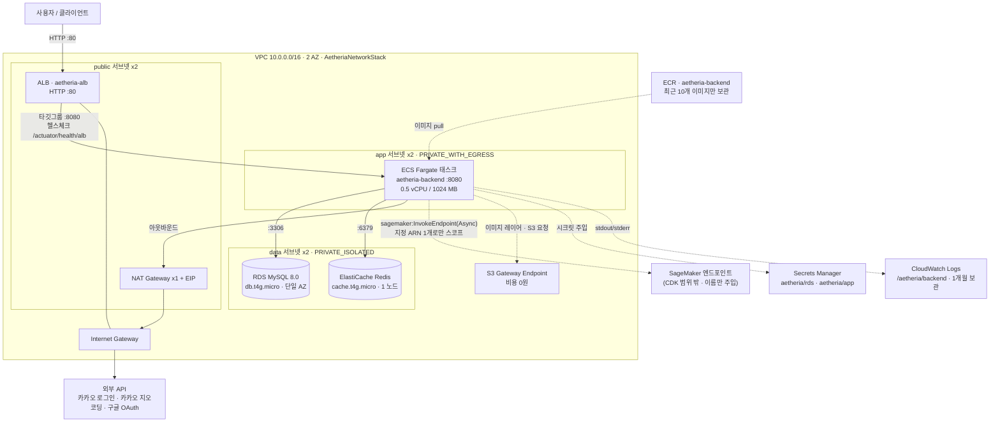
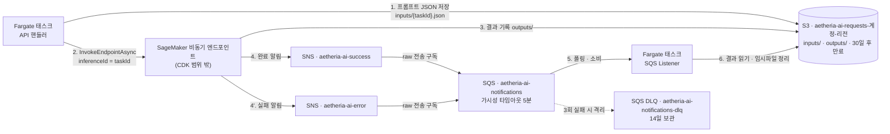
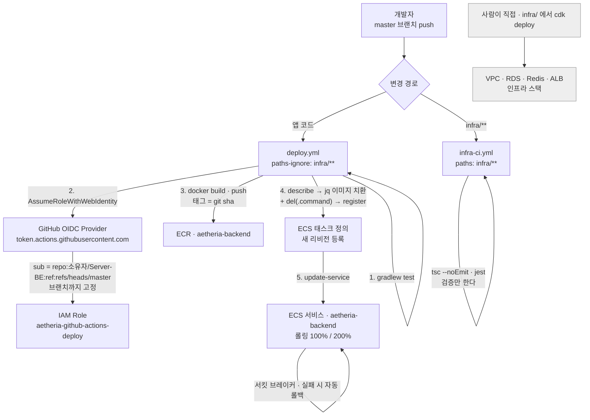

# Aetheria 인프라 구성도

이 문서의 다이어그램은 `infra/` 가 **실제로 합성하는 리소스**를 그린 것이다.
기억이나 설계 문서가 아니라 아래 명령의 출력에서 뽑았다. (`infra/` 에서 실행한다)

```bash
npx cdk synth --all -c imageTag=<sha> -c sagemakerEndpointName=<이름> \
  -c githubOwner=<소유자> -c githubRepo=Server-BE
```

---

## 1. 런타임 아키텍처



**보안그룹 4종 · ingress 규칙 3개** (전부 `AetheriaNetworkStack` 소유)

| 보안그룹 | 허용하는 인바운드 |
| --- | --- |
| `aetheria-alb-sg` | `0.0.0.0/0` → 80 (인증서를 주면 443 추가) |
| `aetheria-app-sg` | `aetheria-alb-sg` → 8080 |
| `aetheria-rds-sg` | `aetheria-app-sg` → 3306 |
| `aetheria-redis-sg` | `aetheria-app-sg` → 6379 |

각 계층은 **바로 앞 계층의 보안그룹에서 오는 트래픽만** 받는다. CIDR 기반 허용은 ALB 앞단 하나뿐이다.

---

## 2. 비동기 AI 파이프라인

큐를 소비하는 주체가 **같은 Fargate 태스크 안의 리스너**라는 점에 주의한다 (별도 워커가 없다).

큐에 메시지를 넣는 주체는 백엔드가 아니라 **SageMaker**다. 그런데 SageMaker 비동기 추론의
`NotificationConfig`는 **SNS 토픽만** 받는다. SQS를 직접 지정할 수 없다.
그래서 토픽을 두고, 그 토픽이 큐를 구독하게 한다.



> 구독은 반드시 **raw message delivery**여야 한다. 기본값으로 두면 SNS 봉투
> (`{"Type":"Notification","Message":"..."}`)가 씌워져, 백엔드의 `SageMakerNotificationDto`
> 역직렬화가 전부 실패하고 모든 메시지가 DLQ로 빠진다.

Task Role에 붙는 권한은 이게 전부다: 버킷 읽기/쓰기, 알림 큐 **소비**(송신 권한은 주지 않는다 —
넣는 쪽은 SNS다), DLQ 소비, 그리고 `sagemakerEndpointName`을 준 경우에만 그 엔드포인트 ARN
하나에 대한 `sagemaker:InvokeEndpoint` / `sagemaker:InvokeEndpointAsync`.
백엔드가 호출하는 것은 **비동기 쪽**이라 `InvokeEndpointAsync`가 없으면 실제 추론이 AccessDenied 로 막힌다.

---

## 3. 배포 파이프라인

앱과 인프라는 **한 저장소**에 있지만 **배포 트리거는 분리**되어 있다.
그 분리를 강제하는 것이 각 워크플로우의 경로 필터다.



**CI 는 인프라를 배포하지 않는다.** `infra-ci.yml` 은 타입 체크와 스택 단언을 돌려
"깨졌는지"만 알려 준다. 실제 `cdk deploy` 는 회색 경로 — 사람이 손으로 실행한다.
VPC·RDS 같은 리소스를 push 하나로 바꾸는 것은 되돌리기 어려운 작업이라 자동화하지 않았다.

경로 필터가 없으면 `infra/` 만 고친 커밋도 `gradlew test` → `docker build` → ECR push →
ECS 롤링 배포를 통째로 돌린다. 바뀐 것이 없는데 운영 태스크를 교체하는 셈이다.

---

## 4. 스택별 리소스 인벤토리

`cdk synth` 출력 기준 실제 개수다. (`AWS::CDK::Metadata`는 제외)

### AetheriaNetworkStack

| 리소스 | 개수 |
| --- | --- |
| `AWS::EC2::VPC` | 1 |
| `AWS::EC2::Subnet` | 6 (public/app/data × 2 AZ) |
| `AWS::EC2::RouteTable` / `Route` / `SubnetRouteTableAssociation` | 6 / 4 / 6 |
| `AWS::EC2::InternetGateway` + `VPCGatewayAttachment` | 1 + 1 |
| `AWS::EC2::NatGateway` + `EIP` | 1 + 1 |
| `AWS::EC2::SecurityGroup` | 4 |
| `AWS::EC2::SecurityGroupIngress` | 3 |
| `AWS::EC2::VPCEndpoint` | 1 (S3 게이트웨이) |
| `Custom::VpcRestrictDefaultSG` + Lambda/Role | 1 + 1 + 1 |

`enableInterfaceEndpoints=true`를 주면 인터페이스 엔드포인트 6개가 추가된다 (기본은 비용 때문에 꺼짐).

### AetheriaDataStack

| 리소스 | 개수 |
| --- | --- |
| `AWS::RDS::DBInstance` + `DBSubnetGroup` + `DBParameterGroup` | 1 + 1 + 1 |
| `AWS::ElastiCache::CacheCluster` + `SubnetGroup` | 1 + 1 |
| `AWS::SecretsManager::Secret` | 2 (`aetheria/rds`, `aetheria/app`) |
| `AWS::SecretsManager::SecretTargetAttachment` | 1 |

### AetheriaAppStack

| 리소스 | 개수 |
| --- | --- |
| `AWS::ECR::Repository` | 1 |
| `AWS::ECS::Cluster` / `TaskDefinition` / `Service` | 1 / 1 / 1 |
| `AWS::ElasticLoadBalancingV2::LoadBalancer` / `TargetGroup` / `Listener` | 1 / 1 / 1 |
| `AWS::S3::Bucket` + `BucketPolicy` | 1 + 1 |
| `AWS::SQS::Queue` + `QueuePolicy` | 2 + 2 (알림 큐 + DLQ) |
| `AWS::SNS::Topic` + `Subscription` | 2 + 2 (성공/실패 알림) |
| `AWS::Logs::LogGroup` | 1 |
| `AWS::IAM::Role` / `Policy` | 3 / 2 (Task, Execution, S3 자동삭제용) |
| `AWS::ApplicationAutoScaling::ScalableTarget` + `ScalingPolicy` | 1 + 1 |

인증서를 주면 Listener가 2개(443 forward + 80 리다이렉트)가 된다.

### AetheriaCicdStack

| 리소스 | 개수 |
| --- | --- |
| `Custom::AWSCDKOpenIdConnectProvider` | 1 |
| `AWS::IAM::Role` / `Policy` | 2 / 1 (배포 역할 + 커스텀 리소스용) |

`githubOwner`/`githubRepo` context가 없으면 이 스택은 **아예 합성되지 않는다.**

---

## 5. 백엔드 코드가 맞춰야 하는 계약

인프라 쪽에서 이렇게 주입하고 있으니, 백엔드 코드의 플레이스홀더와 이 이름들이 맞아야 하는 부분이다.

이름은 **백엔드 `application.yml`의 플레이스홀더 기준**이다. 그쪽 플레이스홀더에는 기본값이 없어,
하나라도 어긋나면 컨테이너가 `Could not resolve placeholder` 로 기동조차 하지 못한다.
`test/aetheria-cdk.test.ts`의 "백엔드 계약" 블록이 이 목록을 강제한다.

**컨테이너**

| 항목 | 값 |
| --- | --- |
| 리슨 포트 | `8080` (`SERVER_PORT`로도 주입) |
| 헬스체크 | `GET /actuator/health/alb` → **200** |
| 기동 유예 | 180초 (Flyway 마이그레이션까지 끝나야 readiness 가 올라온다) |
| 아키텍처 | `linux/amd64` (`X86_64`) — Apple Silicon에서 빌드 시 `--platform` 지정 필요 |

> 헬스체크가 `/actuator/health`가 **아닌** 이유: 기본 엔드포인트는 서킷브레이커·db·redis 인디케이터를
> 모두 집계한다. 카카오 API가 느려져 서킷이 열리는 것만으로 503이 되고, ALB가 멀쩡한 태스크를 죽인다.
> 외부 API 장애가 서비스 전체 장애로 번지는 경로다. ALB 전용 그룹은 `readinessState` 하나만 본다.

**평문 환경변수**

`SPRING_PROFILES_ACTIVE=prod`, `SERVER_PORT`, `SERVER_FORWARD_HEADERS_STRATEGY`, `AWS_REGION`,
`DATABASE_URL`,
`REDIS_HOST`, `REDIS_PORT`, `REDIS_CONNECT_TIMEOUT`, `REDIS_MAX_POOL`,
`AWS_S3_AI_INPUT_BUCKET`, `AWS_S3_AI_OUTPUT_BUCKET`,
`AWS_SQS_AI_NOTIFICATION_QUEUE_NAME`, `AWS_SAGEMAKER_ENDPOINT_NAME`,
`JWT_REFRESH_TOKEN_COOKIE`, `ENCRYPTION_ALGORITHM`,
`RATE_LIMIT_USER_CAPACITY`, `RATE_LIMIT_USER_REFILL_RATE`, `RATE_LIMIT_IP_CAPACITY`, `RATE_LIMIT_IP_REFILL_RATE`,
`KAKAO_REDIRECT_URI`, `GOOGLE_REDIRECT_URI`,
`FRONTEND_DOMAIN`, `DEVELOP_SERVER_DOMAIN`, `PROD_SERVER_DOMAIN`,
`JPA_SHOW_SQL=false`, `JAVA_TOOL_OPTIONS`

> **R2DBC URL은 넣지 않는다.** 백엔드에 R2DBC 의존성 자체가 없다. WebFlux를 쓰지만 영속성은 JPA(JDBC)다.
>
> **Redis에 `SPRING_DATA_REDIS_*`는 통하지 않는다.** 백엔드 `RedisConfig`가 커스텀 `redis.*` 프리픽스에서
> `LettuceConnectionFactory`를 직접 만든다. `REDIS_HOST` / `REDIS_PORT` 여야 한다.
>
> 리디렉트 URI와 CORS 오리진은 ALB DNS가 정해져야 알 수 있어, ALB 생성 후 `addEnvironment`로 뒤늦게 붙인다.
> `domainName` context 를 주면 그쪽이 우선한다.

**Secrets Manager에서 주입되는 환경변수**

`DATABASE_USERNAME`, `DATABASE_PASSWORD` (← `aetheria/rds`)
`JWT_SECRET`, `KAKAO_CLIENT_ID`, `KAKAO_ADMIN_KEY`,
`GOOGLE_CLIENT_ID`, `GOOGLE_CLIENT_SECRET`,
`ENCRYPTION_SECRET_KEY_V1`, `ENCRYPTION_SECRET_KEY_V2`, `DISCORD_WEB_HOOK` (← `aetheria/app`)

> 백엔드에 `kakao.client-secret` 은 없다. `kakao.client-id` 가 곧 REST API 키다.

**GitHub Actions가 전제하는 것**

- 저장소 루트에 `Dockerfile`과 `gradlew`가 있을 것
- `./gradlew test`가 통과할 것 (통합 테스트는 `@Tag("integration")` 으로 분리되어 인프라 없이 통과한다)
- 컨테이너 이름이 태스크 정의의 `aetheria-backend`와 일치할 것 (jq가 이 이름으로 이미지를 치환한다)
- jq가 `.image` 교체와 함께 **`del(.command)`** 를 할 것. 부트스트랩용 nginx 플레이스홀더의
  `command`가 태스크 정의에 남아 있어, 지우지 않으면 Spring 이미지가 nginx 기동 명령으로 실행된다

**아직 비어 있는 것**

- SageMaker 엔드포인트 — 만들 때 `S3OutputPath`를 `InferenceOutputS3Path` 출력값으로,
  `NotificationConfig`의 성공/실패 토픽을 `InferenceSuccessTopicArn` / `InferenceErrorTopicArn` 으로 지정한다.
  그 뒤 `-c sagemakerEndpointName=<이름>`으로 재배포해야 호출 권한이 붙는다
- 도메인/ACM 인증서 — 현재 ALB는 HTTP만 연다. **구글 OAuth는 localhost가 아닌 리디렉트 URI에 HTTPS를
  강제하므로 이 상태에서는 구글 로그인이 동작하지 않는다.** 카카오는 http 리디렉트를 허용한다
- `aetheria/app` 시크릿 값 — 사람이 채워야 한다. 특히 `ENCRYPTION_SECRET_KEY_V1/V2`는 PII 컬럼의
  복호화 키라 **기존 데이터를 이어 쓸 거면 기존 키를 그대로** 넣어야 하고, 빈 문자열이면 기동에 실패한다
